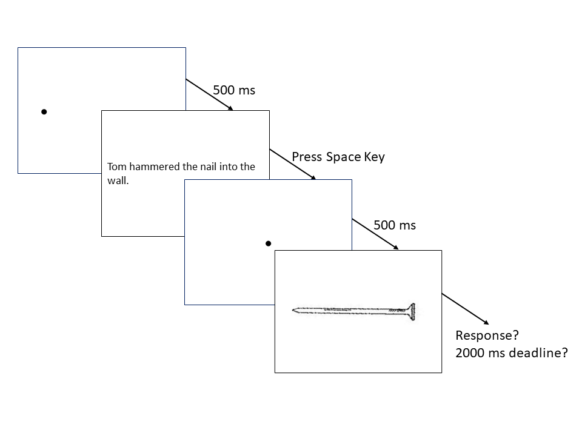
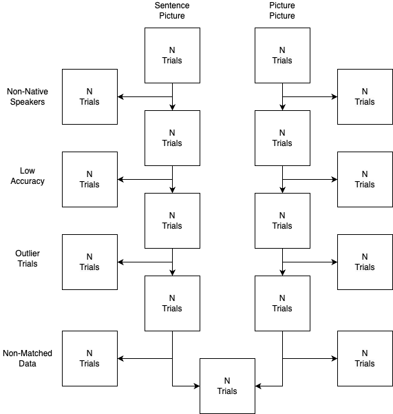
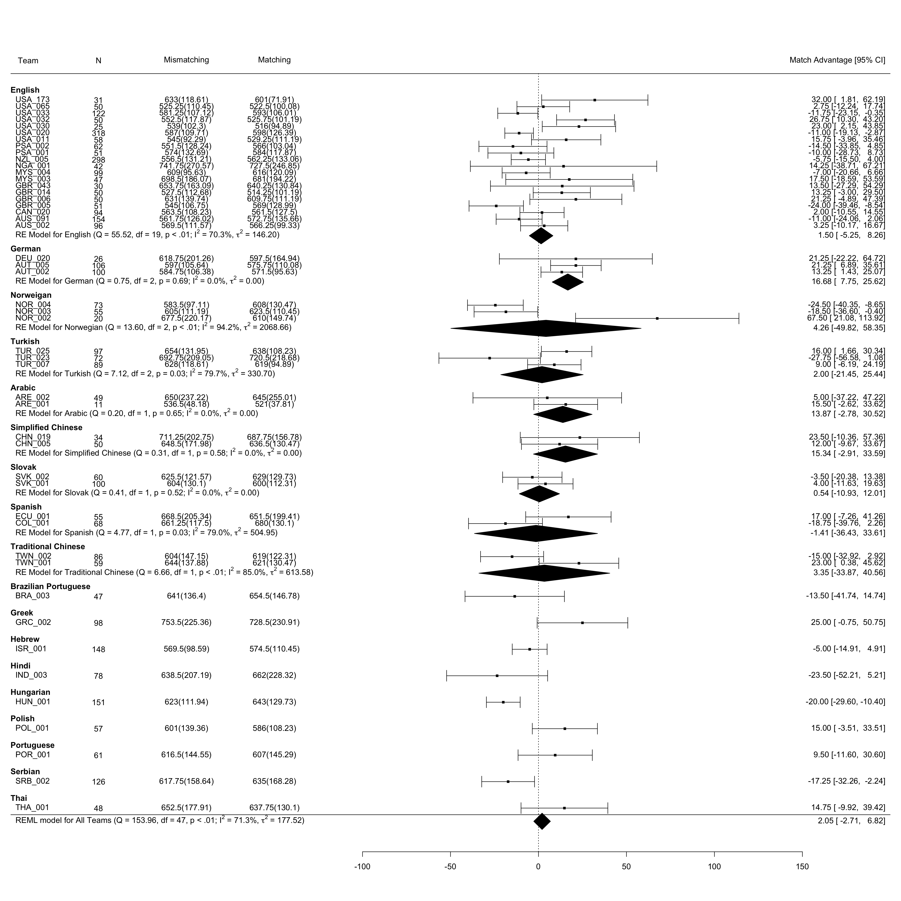

```{r setup, include = FALSE}
 knitr::opts_chunk$set(
	echo = FALSE,
	cache = TRUE
)
 library(tidyverse)
 library(data.table)
 library(lubridate)
 library(magrittr)
 library(knitr)
 library(lme4)
 library(lmerTest)
 library(parameters)
 library(metafor)
 library(afex)
 library(standardize)
 library(sjPlot)
 library(ggplot2)
 library("kableExtra")
 library("papaja")
 library(rio)
 options(scipen=999)
```

```{r analysis-preferences}
# Seed for random number generation
set.seed(42)
knitr::opts_chunk$set(cache.extra = knitr::rand_seed)
```

```{r load_info, message = FALSE, warning = FALSE, include = FALSE}
# Load lab information
# https://osf.io/dtfcg
lab_info <- dir(path = "..", full.names = TRUE, recursive = TRUE, 
    include.dirs = TRUE, pattern = "Lab_Info.csv") %>%
 read_csv()
```

Mental simulation of object properties is a major topic in conceptual processing research [@ostarekSixChallengesEmbodiment2019; @scorolli2014embodiment]. Theoretical frameworks of conceptual processing describe the integration of linguistic representations and situated simulation [e.g., reading about bicycles integrates the situation in which bicycles would be used, @barsalou_grounded_2008; @zwaan_embodiment_2014]. Proponents of situated cognition assume that perceptual representations are able to be generated during language processing. Recently, neuroimaging studies have explored and attempted to corroborate this hypothesis by examining the cortical activation patterns from seeing visual images and reading text [see the summary of @ostarekSixChallengesEmbodiment2019].

One empirical index of situated simulation is the mental simulation effects measured in the sentence-picture verification task (see Figure \@ref(fig:fig01)). This task requires participants to read a probe sentence displayed on the screen. On the following screen, the participants see a picture of an object and must verify whether the object was mentioned in the probe sentence. Verification response times are operationalized as the mental simulation effect, which occurs when people are faster to verify pictured objects whose properties match those of objects implied in the probe sentences. For example, the eagle was moving through the air would be matched faster if an eagle was depicted flying, rather than stationary. 

(Insert Figure \@ref(fig:fig01) about here)

```{r fig01, echo = FALSE, message = FALSE, warning = FALSE, results = 'asis', paged.print = TRUE, fig.cap = "Procedure of sentence-picture verification task."}

```

Mental simulation effects have been demonstrated for object shape [@zwaanLanguageComprehendersMentally2002], color [@connellRepresentingObjectColour2007], and orientation [@stanfield_effect_2001]. Subsequent replication studies revealed consistent results for the shape but inconsistent findings for the color and orientation effects [@koning_mental_2017; @rommersObjectShapeOrientation2013; @zwaanRevisitingMentalSimulation2012], and the theoretical frameworks do not provide researchers much guidance regarding the potential causes for this discrepancy. With the accumulating concerns about the lack of reproducibility, researchers have found it challenging to update the theoretical framework in terms of mental simulation effects being unreplicable [e.g., @kaschakEmbodimentLabTheory2021]. Researchers who intended to improve the theoretical framework necessarily require a reproducible protocol for measuring mental simulation effects.

An additional facet of this research is the linguistic representations of object properties may play a role in the unreliability of the mental simulation effect. Mental simulation effects for object shape have consistently appeared in English [@zwaanEmbodiedSentenceComprehension2005; @zwaanParticipantNonnaiveteReproducibility2017; @zwaanRevisitingMentalSimulation2012], Chinese [@liERPStudyMental2017], Dutch [@engelenPerceptualSimulationDeveloping2011; @koning_mental_2017; @pecherLanguageComprehendersRetain2009; @rommersObjectShapeOrientation2013], German [@kosterMentalSimulationObject2018], Croatian [@seticNumericalCongruencyEffect2017], and Japanese [@satoOneWordTime2013]. Object orientation, on the other hand, has produced mixed results across languages: see positive evidence in English [@stanfield_effect_2001; @zwaanRevisitingMentalSimulation2012] and Chinese [@chenDoesObjectSize2020], null evidence in Dutch  [@rommersObjectShapeOrientation2013; @koning_mental_2017], and German as second language [@kosterMentalSimulationObject2018]. Among the studies of shape and orientation, the results indicated smaller effect sizes of object orientation than that of object shape (e.g., *d* = 0.10 vs. 0.17; in @zwaanRevisitingMentalSimulation2012; 0.07 vs. 0.27 in @koning_mental_2017). To understand the causes for the discrepancies among object properties and languages, it is imperative to consider the cross-linguistic and experimental factors of the sentence-picture verification task.

## Cross-linguistic, Methodological, and Cognitive Factors

Several factors might contribute to cross-linguistic differences in the match advantage of orientation as a mental simulation effect, and we focused on context, methodological, and cognitive factors. Researchers have argued that languages differ in how they encode motion and placement events in sentences [@newmanCrosslinguisticOverviewPosture2002; @verkerkEvolutionaryDynamicsMotion2014]. In addition, the potential role of mental rotation as a confound has been considered [@rommersObjectShapeOrientation2013]. We expand on how the context, experimental, and cognitive factors hinder the improvement of theoretical frameworks below.

**Context Factors.** The probe sentences used in object orientation studies usually contain several motion events (e.g., "The ant walked towards the pot of honey and tried to climb in."). The languages we probed in this study encode motion events in different ways, and grammatical differences between language encodings could explain different match advantage results. According to @verkerkEvolutionaryDynamicsMotion2014, Germanic languages (e.g., Dutch, English, German) generally encode the manner of motion in the verb (e.g., 'The ant dashed'), while conveying the path information through satellite adjuncts (e.g., 'towards the pot of honey'). In contrast, other languages, such as the Romance family (e.g., Portuguese, Spanish) more often encode path in the verb (e.g., 'crossing,' 'exiting'). Crucially, past research on the match advantage of object orientation is exclusively based on Germanic languages, and yet, there were differences across those languages, with English being the only one that consistently yielded the match advantage. As a minor difference across Germanic languages in this regard, @verkerkEvolutionaryDynamicsMotion2014 notes that path-only constructions (e.g., 'The ant went to the feast') are more common in English than in other Germanic languages.

Another topic to be considered is the lexical encoding of placement in each language, as the stimuli contains several placement events (e.g., 'Sara situated the expensive plate on its holder on the shelf.'). @chenDoesObjectSize2020 and @kosterMentalSimulationObject2018 noted that some Germanic languages, such as German and Dutch, often make the orientation of objects more explicit than English. Whereas in English readers could use the verb "put" in both "She put the book on the table" and "She put the bottle on the table," in both Dutch and German, readers could instead say "She laid the book on the table," and "She stood the bottle on the table." In these literal translations from German and Dutch, the verb "lay" encodes a horizontal orientation, whereas the verb "stand" encodes a vertical orientation. This distinction extends to verbs indicating existence. As @newmanCrosslinguisticOverviewPosture2002 exemplified, an English speaker would be likely to say "There's a lamp in the corner," whereas a Dutch speaker would be more likely to say "There 'stands' a lamp in the corner." Nonetheless, we cannot conclude that these cross-linguistic differences are affecting the match advantage across languages because the current theories [e.g., language and situated simulation, @barsalou_grounded_2008] do not precisely define the complexity of linguistic aspects such as placement events.

**Methodological factors.** Inconsistent findings on the match advantage of object orientation may be due to reliability in task design. For example, studies failing to detect the match advantage may not have required participants to verify the probe sentences they had read [see @zwaan_embodiment_2014]. Without such a verification, participants might have paid less attention to the meaning of the probe sentences, in which they would have been less likely to form a mental representation of the objects [e.g., @zwaanReadersConstructSpatial1993]. In this regard, it is relevant to acknowledge that variability originating from individual differences and other characteristics of experiments can substantially influence the results [@barsalouEstablishingGeneralizableMechanisms2019; @kaschakEmbodimentLabTheory2021].

**Cognitive Factors.** Since @stanfield_effect_2001 showed a match advantage of object orientation, later studies on this topic have examined the association between the match advantage and alternative cognitive mechanisms rather than the situated simulation. Spatial cognition is one of the potential cognitive mechanisms, which may be measured with mental rotation tasks. Studies have suggested that mental rotation tasks offer valid reflections of previous spatial experience [@frickMentalObjectRotation2013] and of current spatial cognition [@chuSpontaneousGesturesMental2008; @pouwMoreEmbeddedExtended2014]. @koning_mental_2017 suggested that effectiveness of mental rotation could increase with the depicted object size. @chenDoesObjectSize2020 examined this implication in use of the picture-picture verification task that was designed using the mental rotation paradigm [@cohenMentalRotationMental1993]. In each trial of this task, two pictures appear on opposite sides of the screen. Participants had to verify whether the pictures represent identical or different objects. This study not only indicated shorter verification times for the same orientation (i.e., two identical pictures presented in horizontal or vertical orientation) but also showed the larger time difference for the large size object (i.e., pictures of bridges versus pictures of pens). The pattern of results were consistent among their investigated languages: English, Dutch, and Chinese. In comparison with the results of sentence-picture verification and picture-picture verification, @chenDoesObjectSize2020 depicted that mental rotation may affect the comprehension in some languages versus others by converting the picture-picture verification times to the mental rotation scores that were the discrepancy of verification times between the identical and different orientation[^1]. With this measurement, we explore the relation of mental rotation in spatial cognition and orientation effect in comprehension across the investigated languages.

[^1]: In the preregistered plan, we used the term "imagery score" but this term was confusing. Therefore, we used "mental rotation scores" instead of "imagery scores" in the final report.

## Purposes of this study

To scrutinize the discrepancies findings across languages and cognitive factors, we examined the reproducibility of the object orientation effect in a multi-lab collaboration. Our preregistered plan aimed at detecting a general match advantage of object orientation across languages and evaluated the magnitude of match advantage in each specific language. Additionally, we examined if match advantages were related to the mental rotation index. Thus, this study followed the original methods from @stanfield_effect_2001 and addressed two primary questions: (1) How much of the match advantage of object orientation can be obtained within different languages and (2) How do differences in the mental rotation index affect the match advantage across languages?

# Method

## Hypotheses and Design

The study design for the sentence-picture and picture-picture verification task was mixed using between-participant (language) and within-participant (match versus mismatch object orientation) independent variables. In the sentence-picture verification task, the match condition reflects a match between the sentence and the picture, whereas in the picture-picture verification, it reflects a match in orientation between two pictures. The only dependent variable for both tasks was response time. The time difference between conditions in each task are the measurement of mental simulation effects (for the sentence-picture task) and mental rotation scores (for the picture-picture task). We did not select languages systematically, but instead based on our collaboration recruitment with the Psychological Science Accelerator [PSA, @moshontzPsychologicalScienceAccelerator2018].

We pre-registered the following hypotheses:

(1) In the sentence-picture verification task, we expected response times to be shorter for matching compared to mismatching orientations within each language. In the picture-picture verification task, we expected shorter response time for identical orientation compared to different orientations. We did not have any specific hypotheses about the relative size of the object orientation match advantage in different languages.

(2) Based on the assumption that the mental rotation is a general cognitive function, we expect equal mental rotation scores across languages but no association with mental simulation effects [see @chenDoesObjectSize2020].

```{r all_data, message = FALSE, warning = FALSE, include = FALSE}
# Load raw SPV data 
# Build data frame of valid SP verification responses
all_files <- list.files(path = "data",
                         pattern = ".csv", 
                         full.names = TRUE,
                         recursive = TRUE)
all_files <- all_files[grepl("PP|SP|jatos_results|pp|sp|Pp|Sp", all_files)]

all_list <- list()
for (i in 1:length(all_files)){
  all_list[[i]] <- import(all_files[i])
  all_list[[i]]$unique_id <- all_files[i]
  
  all_list[[i]] <- all_list[[i]] %>% 
    mutate(across(everything(), as.character))
}

all_data <- bind_rows(all_list) %>% 
  select(subject_nr, 
         LAB_SEED, 
         datetime, 
         logfile, 
         task_order,
         List, 
         PList,
         Match,
         Orientation, 
         Probe,
         Target,
         response_time, 
         correct,
         PPList, 
         Orientation1,
         Orientation2, 
         Identical,
         Picture1,
         Picture2, 
         opensesame_codename,
         opensesame_version,
         unique_id) %>% 
  filter(!is.na(opensesame_codename))

all_data$PSA_ID <- substr(all_data$unique_id, 6, 13)
all_data$PSA_ID <- gsub("\\/", "", all_data$PSA_ID)

all_data$subject_nr[na.omit(all_data$opensesame_codename != "osweb")] <- 
  gsub("data/|SP|PP|_|-| |.csv", "", all_data$unique_id[na.omit(all_data$opensesame_codename != "osweb")])

SP_V <- all_data %>% select(
  PSA_ID, subject_nr, LAB_SEED, datetime, logfile, task_order, List,
  Match, Orientation, PList, Probe, Target, response_time, correct, 
  opensesame_codename, opensesame_version) %>% 
  left_join(lab_info %>% select(PSA_ID, Language), by = "PSA_ID") %>% 
  readr::type_convert() %>% 
  distinct() %>% 
  mutate(Language = ifelse(Language == "Magyar", "Hungarian", Language)) %>% ## Switch "Magyar" to "Hungarian"
 mutate(Language = ifelse(Language == "Simple Chinese", "Simplified Chinese", Language)) %>% ## Switch "Simple Chinese" to "Simplified Chinese"
 mutate(PSA_ID = str_replace(PSA_ID, "SRB_002B", "SRB_002")) %>% ## Combine two Serbian language groups based on the collectors' recommendation
 mutate(Source = if_else(opensesame_codename == "osweb","osweb","site"), 
  Subject = paste0(Source,"_",PSA_ID,"_",subject_nr, "_", datetime)) %>% ## Compose the unique participant id
 subset(Match != "F") ## Exclude fillers in SP_V

# Build data frame of valid PP responses
PP <- all_data %>% select(
  PSA_ID, LAB_SEED, datetime, logfile, subject_nr, PPList, 
  Orientation1, Orientation2, Identical, Picture1, Picture2, 
  response_time, correct, opensesame_codename, opensesame_version) %>% 
  left_join(lab_info %>% select(PSA_ID, Language), by = "PSA_ID") %>% 
  readr::type_convert() %>% 
  distinct() %>% 
  mutate(Language = ifelse(Language == "Magyar", "Hungarian", Language)) %>% ## Switch "Magyar" to "Hungarian"
  mutate(Language = ifelse(Language == "Simple Chinese", "Simplified Chinese", Language)) %>% ## Switch "Simple Chinese" to "Simplified Chinese"
  mutate(PSA_ID = str_replace(PSA_ID, "SRB_002B", "SRB_002")) %>% ## Combine two Serbian language groups based on the collectors' recommendation
  mutate(Source = if_else(opensesame_codename == "osweb","osweb","site"), 
  Subject = paste0(Source,"_",PSA_ID,"_",subject_nr, "_", datetime)) %>%  ## Compose the unique participant id
  filter(Identical != "F") # practice trials 

SP_V$Subject[SP_V$opensesame_codename != "osweb"] <- paste0(SP_V$Source[SP_V$opensesame_codename != "osweb"],"_",SP_V$PSA_ID[SP_V$opensesame_codename != "osweb"],"_",SP_V$subject_nr[SP_V$opensesame_codename != "osweb"])

PP$Subject[PP$opensesame_codename != "osweb"] <- paste0(PP$Source[PP$opensesame_codename != "osweb"],"_",PP$PSA_ID[PP$opensesame_codename != "osweb"],"_",PP$subject_nr[PP$opensesame_codename != "osweb"])
```

```{r fix_part_id, message = FALSE, warning = FALSE, include = FALSE}
PP$Subject[PP$Subject == "site_MYS_003_MYS003/MYS00324"] <- rep(c("site_MYS_003_MYS003/MYS00324", "site_MYS_003_MYS003/MYS00324_1"), each = 24)

SP_V$Subject[SP_V$Subject == "site_USA_173_USA173/USA17328"] <- c(rep("site_USA_173_USA173/USA17328", 30), rep("site_USA_173_USA173/USA17328_1", 29))

# fix issues with duplicate trials 
SP_V <- SP_V %>% 
  filter(!duplicated(SP_V %>% select(Subject, Target)))
PP <- PP %>% 
  filter(!duplicated(PP %>% select(Subject, Picture1)))

# test subjects counts
SP_V_subjects <- SP_V %>% 
  group_by(Subject, PSA_ID) %>% 
  count() 

PP_subjects <- PP %>% 
  group_by(Subject, PSA_ID) %>% 
  count()

merge_subjects <- SP_V_subjects %>% 
  full_join(PP_subjects, by = "Subject") %>% 
  rename(SP_Data = n.x,
         PP_Data = n.y)

merge_subjects$PSA_ID.x[is.na(merge_subjects$PSA_ID.x)] <- merge_subjects$PSA_ID.y[is.na(merge_subjects$PSA_ID.x)]

merge_subjects$PSA_ID <- merge_subjects$PSA_ID.x

merge_subjects <- merge_subjects %>% select(-PSA_ID.x, -PSA_ID.y)
```

```{r import_gender}
osweb_meta <- dir(path = "..",full.names = TRUE, recursive = TRUE, include.dirs = TRUE, pattern = "jatos_meta.csv") %>%
  read_csv() %>%
  unique() %>% 
  mutate(Batch = str_replace(Batch, "SRB_002B", "SRB_002")) %>% 
  mutate(gender = ifelse(gender==1,"FEMALE",ifelse(gender==2,"MALE","MISSING"))) %>%
  # mutate(birth_year_tr = as.numeric(birth_year)) %>%
  mutate(birth_year_tr = as.numeric(gsub(birth_year,pattern="NA|x",replacement = ""))) %>%
  mutate(year = ifelse(birth_year_tr > 21 & !is.na(birth_year_tr), 1900 + birth_year_tr, 2000 + birth_year_tr)) %>%
  mutate(age = ifelse(!is.na(year),2021-year,NA)) %>%
  group_by(Batch) %>%
  summarise(N = n(), 
            Female_N = sum(gender=="FEMALE",na.rm = TRUE), 
            Male_N = sum(gender=="MALE", na.rm = T), 
            Age = mean(age, na.rm=TRUE), 
            AgeSD = sd(age, na.rm=TRUE), 
            Proficiency = mean(lang_prof))

site_meta <- import("includes/files/insite_meta.csv") %>% 
  mutate(gender = ifelse(gender=="female","FEMALE",ifelse(gender=="male","MALE","MISSING"))) %>%
  unique() %>% 
  group_by(PSA_ID) %>% 
  summarize(N = n(), Female_N = sum(gender=="FEMALE", na.rm = TRUE), 
            Male_N = sum(gender=="MALE", na.rm = T), 
            Age = mean(age, na.rm=TRUE),
            AgeSD = sd(age, na.rm=TRUE), 
            )

merge_subjects <- merge_subjects %>% 
  group_by(PSA_ID) %>% 
  summarize(SP_N_trials = sum(SP_Data, na.rm = T),
            PP_N_trials = sum(PP_Data, na.rm = T),
            SP_N = length(na.omit(SP_Data)),
            PP_N = length(na.omit(PP_Data))) %>% 
  full_join(site_meta, by = "PSA_ID") %>% 
  full_join(osweb_meta, by = c("PSA_ID" = "Batch"))

merge_subjects <- merge_subjects %>% 
  group_by(PSA_ID) %>% 
  mutate(Overall_N_Gender = sum(c(N.x, N.y), na.rm = T),
         Overall_N_Female = sum(c(Female_N.x, Female_N.y), na.rm = T),
         Overall_N_Male = sum(c(Male_N.x, Male_N.y), na.rm = T),
         Overall_Age = mean(c(Age.x, Age.y), na.rm = T), 
         Overall_SD = mean(c(AgeSD.x, AgeSD.y), na.rm = T)) %>% 
  left_join(lab_info %>% select(PSA_ID, Language) %>% unique(), by = "PSA_ID")
```

## Participants

The preregistered power analysis indicated *n* = 156 to 620 participants for 80% power for a directional one-sample *t*-test for a *d* = 0.20 and 0.10, respectively. A mixed-model simulation suggested that *n* = 400 participants with 100 items (i.e., 24 planned items nested within at least five languages) would produce 90% power to detect the same effect as @zwaanRevisitingMentalSimulation2012. The laboratories were allowed to follow a secondary plan: a team collected at least their preregistered minimum sample size (suggested 100 to 160 participants, most implemented 50), and then determine whether or not to continue data collection via Bayesian sequential analysis (stopping data collection if $BF_{10}$ = 10 or 1/10)[^2].

[^2]: See details of power analysis in the preregistered plan, p. 13 \~ 15. <https://psyarxiv.com/t2pjv/>

We finally collected data in `r length(unique(SP_V$Language))` languages from `r length(unique(c(SP_V$PSA_ID, PP$PSA_ID)))` laboratories. Each laboratory chose a maximal sample size and an incremental *n* for sequential analysis before their data collection. Because the preregistered power analysis did not match the final analysis plan, we additionally completed a sensitivity analysis to ensure sample size was adequate to detect small effects, and the results indicated that each effect could be detected at a 2.23 millisecond range for the mental simulation effect of object orientation. Appendix 1 summarizes the details of sensitivity analysis.

The original sample sizes are presented in Table \@ref(tab:sample-table) for the teams that provided raw data to the project. Data collection proceeded in two broad stages: initially we collected data in the laboratory. However, when the global Covid-19 pandemic made this practice impossible to continue, we moved data collection online. For the in person data collection, demographic data was collected within a bundled, unrelated study that participants completed (Phills et al., in preparation). When the data collection was moved online, the demographic data collection was integrated into the current study $n_{demographic}$ = `r format((sum(osweb_meta$N)+sum(site_meta$N)), big.mark = ",")`. In both cases, the demographic data was separated from the experimental data. The in-person data required the experimenter to enter the lab ID information into the second study. Data entry errors in this stage resulted in some demographic information being excluded due to the inability to match to a particular lab *n* = `r merge_subjects %>% filter(!(PSA_ID %in% unique(SP_V$PSA_ID))) %>% pull(Overall_N_Gender) %>% sum()`. Additionally, some participants completed only the bundled study, and therefore, demographic sample sizes may be higher than the data collected for this study. 

In total, `r format(length(unique(c(SP_V$Subject, PP$Subject))), scientific = FALSE, big.mark = ",")` unique participants completed the study with `r format(length(unique(c(SP_V$Subject[SP_V$opensesame_codename != "osweb"], PP$Subject[PP$opensesame_codename != "osweb"]))), scientific = FALSE, big.mark = ",")` completing the in person version and `r format(length(unique(c(SP_V$Subject[SP_V$opensesame_codename == "osweb"], PP$Subject[PP$opensesame_codename == "osweb"]))), scientific = FALSE, big.mark = ",")` completing the online version. The in person version included `r length(unique(SP_V$PSA_ID[SP_V$opensesame_codename != "osweb"]))` research teams and the online version included `r length(unique(SP_V$PSA_ID[SP_V$opensesame_codename == "osweb"]))` with `r length(unique(SP_V$PSA_ID))` total teams across both data collection methods (i.e., some labs completed both in person and online data collection). Based on recommendations from research teams, two sets of data were excluded from all analyses due to participants being non-native speakers. Figure \@ref(fig:sample-fig) provides a flow chart for participant exclusion and inclusion for analyses. All participating laboratories had either ethical approval or institutional evaluation before data collection. All data and analysis scripts are available on the source files (CODE OCEAN). Appendix 2 summarizes the average characteristics by language and laboratory.

```{r sample-table, results = 'asis'}
merge_subjects %>% 
  arrange(Language) %>% 
  ungroup() %>% 
  filter(PSA_ID %in% unique(SP_V$PSA_ID)) %>%
  group_by(Language) %>% 
  summarize(SP_N_trials = sum(SP_N_trials, na.rm = T), 
            PP_N_trials = sum(PP_N_trials, na.rm = T), 
            SP_N = sum(SP_N, na.rm = T),
            PP_N = sum(PP_N, na.rm = T), 
            Overall_N_Gender = sum(Overall_N_Gender, na.rm = T), 
            Overall_N_Female = sum(Overall_N_Female, na.rm = T),
            Overall_N_Male = sum(Overall_N_Male, na.rm = T), 
            Overall_Age = mean(Overall_Age, na.rm = T), 
            Overall_SD = mean(Overall_SD, na.rm = T)) %>% 
  ungroup() %>% 
  select(Language, SP_N_trials, PP_N_trials, SP_N, PP_N, 
         Overall_N_Gender, Overall_N_Female, Overall_N_Male, 
         Overall_Age, Overall_SD) %>% 
  mutate(
    Overall_Age = format(round(Overall_Age, 2), nsmall = 2), 
    Overall_SD = format(round(Overall_SD, 2), nsmall = 2)
  ) %>% 
  apa_table(
 format = "latex",
 booktabs = TRUE,
 escape = TRUE,
 font_size = "footnotesize",
 col.names = c("Language", "SP \nTrials",
               "PP \nTrials", "SP \nN", "PP \nN", "Demo \nN",
               "Female \nN", "Male \nN","M \nAge", "SD \nAge"),
 align = c("l", rep("c", 9)),
 caption = "Demographic and Sample Size Characteristics",
 note = "SP = Sentence Picture Verification, PP = Picture Picture Verification. Sample sizes for demographics may be higher than the sample size for the this study, as participants could have only completed the bundled experiment. Additionally, not all entries could be unambigously matched by lab ID, and therefore, demographic sample sizes could also be less than data collected."
 ) 
```

```{r exclude-nonnative}
SP_V_non <- SP_V %>% 
  filter(PSA_ID != "TUR_007E" & PSA_ID != "TWN_002E")

PP_non <- PP %>% 
  filter(PSA_ID != "TUR_007E" & PSA_ID != "TWN_002E")
```

(Insert Figure \@ref(fig:sample-fig) about here)

```{r sample-fig, echo = FALSE, message = FALSE, warning = FALSE, results = 'asis', paged.print = TRUE, fig.cap = "Sample size and exclusions. N = number of unique participants, T = number of trials. The final combined sample was summarized to a median score for each match/mismatch condition, and therefore, includes one summary score per person."}

```

## General Procedure and Materials

In the beginning of the sentence-picture verification task, participants had to correctly answer all the practice trials. Each trial started with a left-justified and horizontally centered fixation point displayed for 1000 ms, immediately followed by the probe sentence. The sentence was presented until the participant pressed the space key, acknowledging that they understood the sentence. Then, the object picture [from @zwaanRevisitingMentalSimulation2012] was presented in the center of the screen until the participant responded or it disappeared after 2 s. Participants were instructed to verify that the object on screen was mentioned in the probe sentence as quickly and accurately as they could. Following the original study [@stanfield_effect_2001], a memory check test was carried out after every three to eight trials to ensure that the participants had read each sentence carefully.

The picture-picture verification task used the same object pictures. In each trial, two objects appeared on either side of the central fixation point until either the participant indicated that the pictures displayed the same object or two different objects or until 2 s elapsed. In the trials where the same object was displayed, the pictures on each side were presented in the same orientation (both were horizontal/vertical) or different orientations (one was horizontal, one was vertical).

The study was executed using OpenSesame software for millisecond timing [@mathotOpenSesameOpensourceGraphical2012]. After data collection moved online, in order to minimize the differences between on-site and web-based studies, we converted the original Python code to Javascript and collected the data using OpenSesame through a JATOS server [@langeJustAnotherTool2015; @mathot_conducting_2022]. We proceeded with the online study from February to June 2021 after the changes in the procedure were approved by the journal editor and reviewers. Following the literature, we did not anticipate any theoretically important differences between the two data collection methods [see @anwyl-irvineGorillaOurMidst2020; @bridgesTimingMegastudyComparing2020a; @deleeuwPsychophysicsWebBrowser2016]. The instructions and experimental scripts are available at the public OSF folder (<https://osf.io/e428p/> "Materials" in Files).

## Analysis Plan

Our first planned analysis[^3] employed a random-effects meta-analysis model that estimated the match advantage across laboratories and languages. The meta-analysis summarized the median reaction times by match condition to determine the effect size by laboratory ($d = \frac{Mdn_{Mismatch} - Mdn_{Match}}{\sqrt{MAD_{Mismatch}^2 + MAD_{Match}^2}-2\times r\times MAD_{Mismatch} \times MAD_{Match}} \times \sqrt{2 \times (1-r)}$). For the languages for which at least two teams collected data, we computed the meta-analytical effect size of that language.

[^3]: See the analysis plan in the preregistered plan, p. 19 \~ 20. <https://psyarxiv.com/t2pjv/> This plan was changed to a random-effects model to ensure that we did not assume the exact same effect size for each language and lab.

Next, we ran planned mixed-effect models using each individual response time from the sentence-picture verification task as the dependent variable. In each analysis we first built a simple linear regression model with a fixed intercept only. Then, we systematically added fixed effect and random intercepts arriving at the final model. First, the random intercepts were added to the model one-by-one in the following order: participant ID, target, laboratory ID, and finally language. We compared the model fit measured by the AIC at each of these steps, to determine the best random effect structure for the model. Models with lower AIC were preferred over models with higher AIC, and in a case where the difference in AIC did not reach 2, the model with the fewer parameters was preferred. Then, the fixed effect of matching condition (match vs. mismatch) was added to the model. Language-specific mixed-effect models were conducted in the same way if the meta-analysis showed a significant orientation effect.

According to the preregistration, we planned to first evaluate the equality of mental rotation scores across languages using an ANOVA. However, this plan was updated to use mixed models instead due the nested structure of the data. The same analysis plan was used for model building and selection as described above for the sentence-picture verification task. The last planned analysis was to use mental rotation scores for the prediction of mental stimulation with an interaction between language and mental rotation scores to determine there were differences in prediction of match advantage based on language. This model was updated to a mixed-effects model to control for the random effect of the data collection lab.

**Decision criterion.** *p*-values were interpreted using the preregistered alpha level of .05. *p*-values for each effect were calculated using the Satterthwaite approximation for degrees of freedom for individual predictor coefficients and meta-analysis [@lukeEvaluatingSignificanceLinear2017].

**Intra-lab analysis during data collection.** Before data collection, each lab decided whether they wanted to apply a sequential analysis [@schonbrodtSequentialHypothesisTesting2017] or whether they wanted to settle for a fixed sample size. The preregistered protocol for labs applying sequential analysis established that they could stop data collection upon reaching the preregistered criterion ($BF_{10} = 10\ or\ -10$), or the maximal sample size. Each laboratory chose a fixed sample size and an incremental *n* for sequential analysis before their data collection. Two laboratories (HUN_001, TWN_001) stopped data collection at the preregistered criterion, $BF_{10} = -10$. Fourteen laboratories did not finish the sequential analysis because (1) twelve laboratories were interrupted by the pandemic outbreak; (2) two laboratories (TUR_007E, TWN_002E) recruited English-speaking participants to comply with institutional policies. Lab-based records were reported on a public website as each laboratory completed data collection (details are available in Appendix 3).

# Results

## Data Screening

```{r}
SP_V_acc_summary <- SP_V_non %>% 
  group_by(Subject) %>% 
  summarize(accuracy = sum(correct)/n())

SP_V_acc <- SP_V_non %>% 
  filter(Subject %in% (SP_V_acc_summary %>% 
                         filter(accuracy >=.70) %>% 
                         pull(Subject) %>% 
                         unique()))

PP_acc_summary <- PP_non %>% 
  group_by(Subject) %>% 
  summarize(accuracy = sum(correct)/n())

PP_acc <- PP_non %>% 
  filter(Subject %in% (PP_acc_summary %>% 
                         filter(accuracy >=.70) %>% 
                         pull(Subject) %>% 
                         unique()))
```

As shown in Figure \@ref(fig:sample-fig), entire participants were first removed from the sentence-picture and picture-picture tasks if they did not perform at 70% accuracy. Next, the data were screened for outliers. Our preregistered plan excluded outliers based on a linear mixed-model analysis for participants in the third quantile of the grand intercept (i.e., participants with the longest average response times). After examining the data from both online and in-person data collection, it became clear that both a minimum response latency and maximum response latency should be employed, as improbable times existed at both ends of the distribution [@kvalsethHickLawEquivalent2021; @proctorHickLawChoice2018]. The minimum response time was set to 160 ms. The maximum response latency was calculated as two times the mean absolute deviation plus the median calculated separately for each participant. Exclusions were performed at the trial level for these outlier response times. 

```{r outliers}
SP_V_noout <- SP_V_acc %>% 
 group_by(Subject) %>% 
 mutate(MAD = mad(response_time),
  med = median(response_time),
  Outlier = response_time <= 160 | response_time >= (med + 2*MAD)) %>% 
  filter(Outlier == FALSE)

PP_noout <- PP_acc %>% 
 group_by(Subject) %>% 
 mutate(MAD = mad(response_time),
  med = median(response_time), 
  Outlier = response_time <= 160 | response_time >= (med + 2*MAD)) %>% 
  filter(Outlier == FALSE)
```

```{r SP-source-lme, message = FALSE, warning = FALSE, include = FALSE}
SP_V_noout$r_Source <- SP_V_noout$opensesame_codename == "osweb"
source_cor.lmer <- lmerTest::lmer(
 response_time ~ Match*r_Source + 
 (1|Subject) + 
 (r_Source|PSA_ID) + 
 (r_Source|Language), 
 control = lmerControl(optimizer = "bobyqa",
   optCtrl = list(maxfun = 1e6)), 
 data = SP_V_noout)

source_cor_lmer_out <- summary(source_cor.lmer)

# summary(source_cor.lmer)
```

In order to ensure equivalence between data collection methods, we evaluated the response times predicted by the fixed effects of the interaction between match (match versus mismatch) and data collection source (in person, online). We included random intercepts of participant, lab, language, and random slopes of source by lab, and source by language. This analysis showed no difference between data sources: *b* = `r format(round(source_cor_lmer_out$coefficients[4,1], 2), nsmall = 2)`, *SE* = `r format(round(source_cor_lmer_out$coefficients[4,2], 2), nsmall = 2)`, *t*(`r format(round(source_cor_lmer_out$coefficients[4,3], 2), nsmall = 2)`) = `r format(round(source_cor_lmer_out$coefficients[4,4], 2), nsmall = 2)`, *p* = `r  apa_p(source_cor_lmer_out$coefficients[4,5])`. Therefore, the following analyses did not separate in person and online data. Table \@ref(tab:summary-languages) provides a summary of the match advantage by language for the sentence-picture verification task. 

```{r summary-languages, echo = FALSE, message = FALSE, warning = FALSE, paged.print = TRUE}
# Table in the final report.
# Summarize the participants' accuracy by language.
SP_V_noout %>% 
  group_by(Language, Subject) %>% 
  summarize(accuracy = sum(correct)/n()) %>% 
  group_by(Language) %>% 
  summarize(mean_ACC = format(round(mean(accuracy)*100, digits = 2), nsmall = 2)) %>% 
  left_join(
    SP_V_noout %>% 
      filter(correct == 1) %>% 
      group_by(Language, Subject, Match) %>%
   summarise(subject_M = median(response_time)) %>%
   group_by(Language, Match) %>%
   summarise(med_RT = median(subject_M), MAD_RT = mad(subject_M)) %>%
   pivot_wider(names_from = Match, values_from = c(med_RT, MAD_RT)) %>%
   mutate(Effect = (med_RT_N - med_RT_Y) ) %>%
   transmute(Mismatch_stat = paste0(
     format(round(med_RT_N, digits = 2), nsmall = 2),
     " (", format(round(MAD_RT_N, digits = 2), nsmall = 2),")"),
    Match_stat = paste0(
      format(round(med_RT_Y, digits = 2), nsmall = 2), 
      " (",format(round(MAD_RT_Y, digits = 2), nsmall = 2),")"),
    Effect = Effect) %>%
   arrange(desc(Language)),
   by = c("Language") 
  ) %>% 
 apa_table( 
 format = "latex",
 booktabs = TRUE,
 escape = FALSE,
 col.names = c("Language","Accuracy Percent","Mismatching","Matching","Match Advantage"),
 align = c("l",rep("c",4)),
 caption = "Descriptive Statistics by Language",
 note = "Average accuracy percentage, Median response times and median absolute deviations (in parentheses) per match condition (Mismatching, Matching); Match advantage (difference in response times)."
 ) 
```

## Meta-Analysis

```{r}
SP_V_correct <- SP_V_noout %>% 
  filter(correct == 1)

PP_correct <- PP_noout %>% 
  filter(correct == 1)
```

```{r meta_setup, message = FALSE, warning = FALSE, include = FALSE}
## Prepare the data sets for the meta analysis
SP_V_meta_data <- SP_V_correct %>% 
 group_by(Language, PSA_ID, Subject, Match) %>%
 summarize(RT = median(response_time)) %>%
 pivot_wider(
 names_from = Match,
 values_from = c(RT)
 ) %>%
 group_by(Language, PSA_ID) %>%
 summarise(m_match = median(Y,na.rm = TRUE),
           m_mismatch = median(N,na.rm = TRUE),
           sd_match = mad(Y,na.rm = TRUE),
           sd_mismatch = mad(N,na.rm = TRUE),
           ni = n(),
           ri = cor(Y, N)) 
```

```{r meta-plot}
### a little helper function to add Q-test, I^2, and tau^2 estimate info
mlabfun <- function(text, res) {
 list(bquote(paste(.(text),
   " (Q = ", .(formatC(res$QE, digits = 2, format = "f")),
   ", df = ", .(res$k - res$p),
   ", p ", .(metafor:::.pval(res$QEp, digits = 2, showeq = TRUE, sep = " ")), "; ",
   I^2, " = ", .(formatC(res$I2, digits = 1, format = "f")), "%, ",
   tau^2, " = ", .(formatC(res$tau2, digits = 2, format = "f")), ")")))}

# calculate effect size
SP_V_es <- escalc(measure = "MC", 
                  m1i = m_mismatch, 
                  m2i = m_match, 
                  sd1i = sd_mismatch, 
                  sd2i = sd_match,
                  ni = ni, 
                  ri = ri, 
                  slab = PSA_ID, 
                  data = SP_V_meta_data[
                    c(4:23, 24:26, 31:33, 46:48, 1:2, 37:38, 39:40, 41:42, 
                      44:45, 3, 27, 28, 29, 30, 34, 35, 36, 43),
                  ])
SP_V_meta_all <- rma.uni(yi, vi, data = SP_V_es, method = "REML", digits = 2)

{
  ## save the plot
  png(file = "includes/fig/meta-all.png", width=1400*3, height=1400*3, res = 225)
  
  forest(SP_V_meta_all,
   xlim = c(-300, 200), 
    olim = c(-100, 125),
   ilab = cbind(ni, 
                paste0(round(m_mismatch,2),
                      "(",round(sd_mismatch,2),")"), 
                paste0(round(m_match,2),
                       "(",round(sd_match,2),")")), 
   ilab.xpos = c(-250,-200,-150), 
   ylim = c(-1,40+4*17+6), 
   rows = c(
     21:40+4*17, # English
    18:20+4*16, # Germany
    15:17+4*15, # Norway
    12:14+4*14, # Turkish
    10:11+4*13, # Arabic
    8:9+4*12, # Simplified Chinese
    6:7+4*11, # Slovak
    4:5+4*10, # Spanish
    2:3+4*9, # Traditional Chinese
    1+4*8,  # Brazilian Portuguese
    1+4*7,  # Greek
    1+4*6,  # Hebrew
    1+4*5,  # Hindi
    1+4*4,  # Hungarian
    1+4*3,  # Polish
    1+4*2,  # Portuguese
    1+4,  # Serbian
    1  # Thai
   ), 
   mlab = mlabfun("REML model for All Teams", SP_V_meta_all),
   xlab = "", psize = 0.7)
  
  ### set font expansion factor (as in forest() above) and use a bold font
    op <- par(cex = 1, font = 1)

    ### add additional column headings to the plot
    text(c(-290,-250,-200,-150,170),39+4*17+7,c("Team","N","Mismatching","Matching" ,"Match Advantage [95% CI]"))
  ### switch to bold italic font
  par(font = 2)
  ### add text for the subgroups
  text(-300, c(40+4*17, # English
    20+4*16, # Germany
    17+4*15, # Norway
    14+4*14, # Turkish
    11+4*13, # Arabic
    9+4*12, # Simplified Chinese
    7+4*11, # Slovak
    5+4*10, # Spanish
    3+4*9, # Traditional Chinese
    1+4*8,  # Brazilian Portuguese
    1+4*7,  # Greek
    1+4*6,  # Hebrew
    1+4*5,  # Hindi
    1+4*4,  # Hungarian
    1+4*3,  # Polish
    1+4*2,  # Portuguese
    1+4,  # Serbian
    1  # Thai
    ) + 2, #pos = 2, 
    adj = c(0,1),
      c("English",
      "German",
      "Norweigan",
      "Turkish",
      "Arabic",
      "Simplified Chinese",
      "Slovak",
      "Spanish",
      "Traditional Chinese",
      "Brazilian Portuguese",
      "Greek",
      "Hebrew",
      "Hindi",
      "Hungarian",
      "Polish",
      "Portuguese",
      "Serbian",
      "Thai"))
  
  ### set par back to the original settings
  par(op)

  ### fit fixed-effects model in the language groups
  res.English <- rma.uni(yi, vi, subset = (Language == "English"), data = SP_V_es, method = "REML", digits = 2)
  res.Germany <- rma.uni(yi, vi, subset = (Language == "German"), data = SP_V_es, method = "REML", digits = 2)
  res.Norway <- rma.uni(yi, vi, subset = (Language == "Norwegian"), data = SP_V_es, method = "REML", digits = 2)
  res.Turkish <- rma.uni(yi, vi, subset = (Language == "Turkish"), data = SP_V_es, method = "REML", digits = 2)
  res.Arabic <- rma.uni(yi, vi, subset = (Language == "Arabic"), data = SP_V_es, method = "REML", digits = 2)
  #res.Serbian <- rma.uni(yi, vi, subset = (Language == "Serbian"), data = SP_V_es, method = "REML", digits = 2)
  res.SC <- rma.uni(yi, vi, subset = (Language == "Simplified Chinese"), data = SP_V_es, method = "REML", digits = 2)
  res.Slovak <- rma.uni(yi, vi, subset = (Language == "Slovak"), data = SP_V_es, method = "REML", digits = 2)
  res.Spanish <- rma.uni(yi, vi, subset = (Language == "Spanish"), data = SP_V_es, method = "REML", digits = 2)
  res.TC <- rma.uni(yi, vi, subset = (Language == "Traditional Chinese"), data = SP_V_es, method = "REML", digits = 2)
  
  ### add summary polygons for the three subgroups
  addpoly(res.English, row = 21+4*17-1.5, mlab = mlabfun("RE Model for English", res.English))
  addpoly(res.Germany, row = 18+4*16-1.5, mlab = mlabfun("RE Model for German", res.Germany))
  addpoly(res.Norway, row = 15+4*15-1.5, mlab = mlabfun("RE Model for Norwegian", res.Norway))
  addpoly(res.Turkish, row = 12+4*14-1.5, mlab = mlabfun("RE Model for Turkish", res.Turkish))
  addpoly(res.Arabic, row = 10+4*13-1.5, mlab = mlabfun("RE Model for Arabic", res.Arabic))
  addpoly(res.SC, row = 8+4*12-1.5, mlab = mlabfun("RE Model for Simplified Chinese", res.SC))
  addpoly(res.Slovak, row = 6+4*11-1.5, mlab = mlabfun("RE Model for Slovak", res.Slovak))
  addpoly(res.Spanish, row = 4+4*10-1.5, mlab = mlabfun("RE Model for Spanish", res.Spanish))
  addpoly(res.TC, row = 2+4*9-1.5, mlab = mlabfun("RE Model for Traditional Chinese", res.TC))
  dev.off()
}
```

```{r meta-all-plot, echo = FALSE, message = FALSE, warning = FALSE, results = 'asis', paged.print = TRUE, fig.cap = "Meta-analysis on match advantage of object orientation for all languages"}

```

The planned meta-analysis examined the effect overall and within languages wherein at least two laboratories had collected data (Arabic, English, German, Norway, Simplified Chinese, Traditional Chinese, Slovak, and Turkey). Figure \@ref(fig:meta-all-plot) showed a significant positive orientation effect across German laboratories (*b* = `r as.character(round(res.Germany$b,2))`, 95% CI [`r as.character(round(res.Germany$ci.lb,2))`, `r as.character(round(res.Germany$ci.ub,2))`]) but did not reveal a significant overall effect (*b* = `r as.character(round(SP_V_meta_all$b,2))`, 95% CI [`r as.character(round(SP_V_meta_all$ci.lb,2))`, `r as.character(round(SP_V_meta_all$ci.ub,2))`]). Also, a significant negative orientation effect was found in the Hungarian (*b* = -20.00, 95% CI [-29.60, -10.40]) and the Serbian laboratory (*b* = -17.25, 95% CI [-32.26, -2.24]), although in these languages only a single laboratory participated, so no language-specific meta-analysis was conducted. 

(Insert Figure \@ref(fig:meta-all-plot) about here)

## Mixed-Linear Modeling

```{r SP-lang-lme, message = FALSE, warning = FALSE, include = FALSE}
SP_V_correct$Match <- factor(SP_V_correct$Match, 
                             levels = c("Y", "N"))
# Null effect models
#only intercept
intercept.model <- lm(response_time ~ 1, 
   data = SP_V_correct)
#add random intercept of subject
subject.model <- lmer(response_time ~ 1 + (1|Subject), 
   control = lmerControl(optimizer = "bobyqa",
      optCtrl = list(maxfun = 1e6)), 
   data = SP_V_correct)
# add random intercept of item
item.model <- lmer(response_time ~ 1 + (1|Subject) + (1|Target), 
   control = lmerControl(optimizer = "bobyqa",
      optCtrl = list(maxfun = 1e6)), 
   data = SP_V_correct)
# add random intercept of lab
lab.model <- lmer(response_time ~ 1 + (1|Subject) + (1|Target) + (1|PSA_ID), 
   control = lmerControl(optimizer = "bobyqa",
      optCtrl = list(maxfun = 1e6)), 
   data = SP_V_correct)
# add random intercept of language
language.model <- lmer(response_time ~ 1 + (1|Subject) + (1|Target) + (1|PSA_ID) + (1|Language), 
   control = lmerControl(optimizer = "bobyqa",
      optCtrl = list(maxfun = 1e6)), 
   data = SP_V_correct)
# add fixed effects 
fixed.model <- lmer(response_time ~ Match + (1|Subject) + (1|Target) + (1|PSA_ID), 
   control = lmerControl(optimizer = "bobyqa",
      optCtrl = list(maxfun = 1e6)), 
   data = SP_V_correct)

SP_lme01_out <- summary(fixed.model)$coefficients
```

First, an intercept only model of response times with no random intercepts was computed for comparison purposes `r format(round(AIC(intercept.model), digits = 2), nsmall = 2)`. The model with the participant random intercept was an improvement over this model `r format(round(AIC(subject.model), digits = 2), nsmall = 2)`. The addition of a target random intercept improved model fit over the participant intercept only model `r format(round(AIC(item.model), digits = 2), nsmall = 2)`. Data collection lab was then added to the model as a random intercept, also showing model improvement `r format(round(AIC(lab.model), digits = 2), nsmall = 2)`, and the random intercept of language was added last `r format(round(AIC(language.model), digits = 2), nsmall = 2)` which did not show model improvement at least 2 points change. Last, the fixed effect of match advantage was added with approximately the same fit as the three random-intercept model, `r format(round(AIC(fixed.model), digits = 2), nsmall = 2)`. This model did not reveal a significant effect of match advantage: *b* = `r format(round(SP_lme01_out[2, 1], digits = 2), nsmall = 2)`, *SE* = `r format(round(SP_lme01_out[2,2], digits = 2), nsmall = 2)`, t(`r format(round(SP_lme01_out[2,3], digits = 2), nsmall = 2)`) =  `r format(round(SP_lme01_out[2,4], digits = 2), nsmall = 2)`, *p* = `r apa_p(SP_lme01_out[2, 5])`. 


```{r SP-ger-lme, message = FALSE, warning = FALSE, include = FALSE}
# add random intercept of lab
german.lab.model <- lmer(response_time ~ 1 + (1|Subject) + (1|Target) + (1|PSA_ID), 
   control = lmerControl(optimizer = "bobyqa",
      optCtrl = list(maxfun = 1e6)), 
   data = subset(SP_V_correct, Language == "German"))

german.fixed.three.model <- lmer(response_time ~ Match + (1|Subject) + (1|Target) + (1|PSA_ID) , 
   control = lmerControl(optimizer = "bobyqa",
      optCtrl = list(maxfun = 1e6)), 
   data = subset(SP_V_correct, Language == "German"))

german_output <- summary(german.fixed.three.model)$coefficients
```

We conducted an exploratory mixed-effect model on German data as this was the only language indicating a significant match advantage in the meta-analysis. An intercept-only model with random effects for participants, target, and lab was used as a comparison, as the last random effect (language) could not be used in this model, `r format(round(AIC(german.lab.model), digits = 2), nsmall = 2)`. The addition of the fixed effect of match showed a small improvement over this random-intercept model, `r format(round(AIC(german.fixed.three.model), digits = 2), nsmall = 2)`. This model did not reveal a significant effect of match advantage: *b* = `r format(round(german_output[2, 1], digits = 2), nsmall = 2)`, *SE* = `r format(round(german_output[2,2], digits = 2), nsmall = 2)`, t(`r format(round(german_output[2,3], digits = 2), nsmall = 2)`) =  `r format(round(german_output[2,4], digits = 2), nsmall = 2)`, *p* = `r apa_p(german_output[2, 5])`. All the details of the above fixed effects and random intercepts are summarized in Appendix 4.

## Mental Rotation Scores

```{r PP-null-lme, message = FALSE, warning = FALSE, include = FALSE}
PP_correct$Identical <- factor(PP_correct$Identical, 
                               levels = c("Y", "N"))
PP.intercept.lme <- lm(response_time ~ 1,
   data = PP_correct) 

PP.subject.lme <- lmerTest::lmer(response_time ~ 1 +
   (1 | Subject), # By-subject random intercept
  data = PP_correct,
   control = lmerControl(optimizer = "bobyqa",
                         optCtrl = list(maxfun = 1e6)) # Increase maximum number of iterations to facilitate model convergence 
   ) 

PP.item.lme <- lmerTest::lmer(response_time ~ 1 +
   (1 | Subject) + # By-subject random intercept
   (1 | Picture1), # By-item random intercept
  data = PP_correct,
   control = lmerControl(optimizer = "bobyqa",
                         optCtrl = list(maxfun = 1e6)) # Increase maximum number of iterations to facilitate model convergence 
   ) 

PP.lab.lme <- lmerTest::lmer(response_time ~ 1 +
   (1 | Subject) + # By-subject random intercept
   (1 | Picture1) + # By-item random intercept
   (1 | PSA_ID), # By-lab random intercept
   data = PP_correct,
   control = lmerControl(optimizer = "bobyqa", 
                         optCtrl = list(maxfun = 1e6)) # Increase maximum number of iterations to facilitate model convergence 
   ) 

PP.lang.lme <- lmerTest::lmer(response_time ~ 1 +
   (1 | Subject) + # By-subject random intercept
   (1 | Picture1) + # By-item random intercept
   (1 | PSA_ID) + # By-lab random intercept
   (1 | Language),
   data = PP_correct,
   control = lmerControl(optimizer = "bobyqa", 
                         optCtrl = list(maxfun = 1e6)) # Increase maximum number of iterations to facilitate model convergence 
   ) 

PP.fixed.lme <- lmerTest::lmer(response_time ~ 1 +
   (1 | Subject) + # By-subject random intercept
   (1 | Picture1) + # By-item random intercept
   (1 | PSA_ID) + # By-lab random intercept
   (1 | Language) + 
     Identical,
   data = PP_correct,
   control = lmerControl(optimizer = "bobyqa", 
                         optCtrl = list(maxfun = 1e6)) # Increase maximum number of iterations to facilitate model convergence 
   ) 

PP_output <- summary(PP.fixed.lme)$coefficients
```

Using the same steps as described for the sentence-picture verification mixed model, we first started with an intercept only model with no random effects for comparison `r format(round(AIC(PP.intercept.lme), digits = 2), nsmall = 2)`. The addition of subject `r format(round(AIC(PP.subject.lme), digits = 2), nsmall = 2)`, item `r format(round(AIC(PP.item.lme), digits = 2), nsmall = 2)`, lab `r format(round(AIC(PP.lab.lme), digits = 2), nsmall = 2)`, and language `r format(round(AIC(PP.lang.lme), digits = 2), nsmall = 2)` random intercepts all subsequently improved model fit. Next, the match effect for object orientation was entered as the fixed effect for mental rotation score, `r format(round(AIC(PP.fixed.lme), digits = 2), nsmall = 2)`, which showed improvement over the random intercepts model. This model showed a significant effect of object orientation, *b* = `r format(round(PP_output[2, 1], digits = 2), nsmall = 2)`, *SE* = `r format(round(PP_output[2,2], digits = 2), nsmall = 2)`, t(`r format(round(PP_output[2,3], digits = 2), nsmall = 2)`) =  `r format(round(PP_output[2,4], digits = 2), nsmall = 2)`, *p* = `r apa_p(PP_output[2, 5])`, such that identical orientations were processed faster than rotated orientations. The coefficients of all considered mixed-effects models are reported in Appendix 5, along with all effects presented by language. 

## Prediction of Match Advantage 

```{r prediction_data, message=FALSE, warning=FALSE, include=FALSE}
## Dataset for prediction model
model_data <- PP_correct %>% 
  group_by(Language, Subject, Identical) %>%
  summarise(subject_M = median(response_time)) %>% 
  pivot_wider(names_from = Identical, values_from = subject_M) %>%
  mutate(Imagery = (N - Y)) %>% 
  full_join(
    SP_V_correct %>% 
      group_by(Language, Subject, Match) %>%
      summarise(subject_M = median(response_time)) %>% 
      pivot_wider(names_from = Match, values_from = c(subject_M)) %>%
  mutate(Effect = (N - Y)), 
    by = c("Language", "Subject")
  ) %>% 
  left_join(
    bind_rows(SP_V_correct, PP_correct) %>% 
      select(PSA_ID, Subject) %>% 
      unique(), 
    by = "Subject"
  )  %>% select(PSA_ID, Effect, Language, Imagery) %>% 
  na.omit()
```

```{r prediction_model, message=FALSE, warning=FALSE, include=FALSE}
model_data$Language <- factor(model_data$Language, 
                              levels = unique(model_data$Language)[c(3, 1:2, 4:17)])
pred.intercept <- lm(Effect ~ 1, 
                     data = model_data)

pred.lab <- lmer(Effect ~ 1 + (1|PSA_ID), 
                control = lmerControl(optimizer = "bobyqa",
                           optCtrl = list(maxfun = 1e6)), 
                               data = model_data)

pred.interact <- lmer(Effect ~ Language*Imagery + (1|PSA_ID), 
                control = lmerControl(optimizer = "bobyqa",
                           optCtrl = list(maxfun = 1e6)), 
                               data = model_data)

pred_output <- summary(pred.interact)$coefficients
```


The last analysis included a mixed effects regression model using the interaction of language and mental rotation to predict match advantage. First, an intercept only model was calculated for comparison, `r format(round(AIC(pred.intercept), digits = 2), nsmall = 2)`, which was improved slightly by adding a random intercept of data collection lab, `r format(round(AIC(pred.lab), digits = 2), nsmall = 2)`. The addition of the fixed effects interaction of language and imagery improved the overall model, `r format(round(AIC(pred.interact), digits = 2), nsmall = 2)`. English was used as the comparison group for all language comparisons. No interaction effects or the main effect of mental rotation were significant, and these results are detailed in Appendix 5. 

# Discussion

Results from the meta-analysis and mixed-effects models on match advantage show similar, but slightly convergent results. The meta-analysis showed a small, but greater than zero, effect size for German, while the mixed-effects German model did not support these findings. Both analyses agree that the match advantage effect for object orientation was not supported. In contrast, mixed-effect models indicated significant mental rotation differences with an advantage for identical rotations. However, this rotation advantage does not predict the match advantage nor interact with language to predict object orientation effects. We summarize the lessons learned on the methodology, analysis, and theoretical issues and attempt to address in which aspect the hypotheses obtained the disconfirmative evidence from the current findings.

## Methodology

This study reflected the difficulty of investigating cognition across languages, especially when dealing with effects that require large sample sizes [see @lokenMeasurementErrorReplication2017; @vadilloUnderpoweredSamplesFalse2016]. Our data collection deviated from the preregistered plan because due to the COVID-19 pandemic. Due to the lack of participant monitoring online, and an inspection of the data, we *post hoc* used filtering on outliers in terms of participants' response times for both too quick and too slow responses. After these exclusions, the mixed-effect model confirmed no difference of response times between in person and online data. Although we combined the two data sets in the final data analysis, it is worth considering that online participants' attention may be easily distracted given the lack of any environmental control and lack of experimenter assistance.

When using sentence-picture verification task as a comprehension task, researchers have had to insert the comprehension questions or memory checks among the experimental trials [@chenDoesObjectSize2020; @stanfield_effect_2001]. @kaschakEmbodimentLabTheory2021 pointed out this setting could trigger the participants to consciously generate mental imagery while reading the probe sentence. If the current results showed significant match advantages, we may have had to evaluate the contribution of participants' strategy. However, we do not find that mental imagery predicted match advantage, which implies that this strategy was not effective or unsupported. 

## Analysis Issues  

The sensitivity analysis indicated that a small effect was potentially detectable, and the limited number of trials could be an influencing factor to why the effect was not detectable. Most studies use approximately 24 items (12 match and 12 mismatch), however, these items vary in length and difficulty, which may not be completely controlled using random effects for item. In a classical cognitive capacity measurement, such as Stroop task and Flanker task, the suggested trial numbers are beyond 100 to decrease the trial-level noise [@rouderWhyMostStudies2019]. 

## Theoretical Issues

Mental simulation theories of comprehension have suggested that cognitive processing converts discourse into either abstract symbols or grounded mental representations [@barsalouPerceptualSymbolSystems1999; @barsalouSimulationSituatedConceptualization2009; @zwaan_embodiment_2014]. This study did not support differences in match advantage (minus German effects in the meta-analysis), and therefore, may not support an embodied view of the priming-based mechanism for the reading task as like sentence-picture verification [@kaschakEmbodimentLabTheory2021]. 

The original probe sentences [see @stanfield_effect_2001; @zwaanRevisitingMentalSimulation2012] were the researchers' creations which were compatible with the experimental demands but may not capture the theoretical complexity proposed by embodied views. These sentences describe the interaction between one actor and one object. A different study [@chenDoesObjectSize2020] that found the orientation effect used lab created sentences as well. In comparison with the simple sentences (e.g., Chen et al. used I saw "something"), the second set of sentences addressed how English participants from the original study may have comprehended the sentences and which language-specific aspects may alter the sentence content in non-English studies. We suggest that further explorations could employ the original object pictures after simple and complex sentences. The results will help establish specific guidelines for exploring sentence content.

A secondary task used sentence-picture verification was designed to encourage participants to understand the probe sentences. However, the verification task could potentially have been answered without realizing sentence content. A secondary task could be designed to explore the probe meaning that would require participants to deeply process sentences. Even with the concern of the secondary task inspiring the use of strategies instead of comprehension [e.g., @rommersObjectShapeOrientation2013], a new set of items could explore the effect of secondary task demands (memory checks; comprehension questions). These studies are necessary to distinguish the effects from the targeted cognitive processing and strategy in many language topics, such as semantic priming [@mcnamaraSemanticPrimingPerspectives2005].

```{r picture, include = FALSE, echo = FALSE}
#overall
nrow(SP_V)
sum(merge_subjects$SP_N_trials, na.rm = T)
length(unique(SP_V$Subject))
sum(merge_subjects$SP_N, na.rm = T)

nrow(PP)
sum(merge_subjects$PP_N_trials, na.rm = T)
length(unique(PP$Subject))
sum(merge_subjects$PP_N, na.rm = T)

# non native
nrow(SP_V_non)
length(unique(SP_V_non$Subject))

nrow(SP_V_non) - nrow(SP_V)
length(unique(SP_V_non$Subject)) - length(unique(SP_V$Subject))

nrow(PP_non)
length(unique(PP_non$Subject))

nrow(PP_non) - nrow(PP)
length(unique(PP_non$Subject)) - length(unique(PP$Subject))

# accuracy
nrow(SP_V_acc)
length(unique(SP_V_acc$Subject))

nrow(SP_V_non) - nrow(SP_V_acc)
length(unique(SP_V_non$Subject)) - length(unique(SP_V_acc$Subject))

nrow(PP_acc)
length(unique(PP_acc$Subject))

nrow(PP_non) - nrow(PP_acc)
length(unique(PP_non$Subject)) - length(unique(PP_acc$Subject))

# outliers
nrow(SP_V_noout)
length(unique(SP_V_noout$Subject))

nrow(SP_V_noout) - nrow(SP_V_acc)
length(unique(SP_V_noout$Subject)) - length(unique(SP_V_acc$Subject))

nrow(PP_noout)
length(unique(PP_noout$Subject))

nrow(PP_noout) - nrow(PP_acc)
length(unique(PP_noout$Subject)) - length(unique(PP_acc$Subject))

nrow(model_data)
nrow(model_data) - length(unique(SP_V_noout$Subject))
nrow(model_data) - length(unique(PP_noout$Subject))
```


\newpage

# References

```{r create_r-references, warning = FALSE, cache = FALSE}
r_refs(file = "includes/bib/psa002_r.bib", append = TRUE)
```

```{=tex}
\begingroup
\setlength{\parindent}{-0.5in}
\setlength{\leftskip}{0.5in}
```
::: {#refs}
:::

```{=tex}
\endgroup
```
```{=html}
<!---
\newpage

# (APPENDIX) Appendix {-}
--->
```
