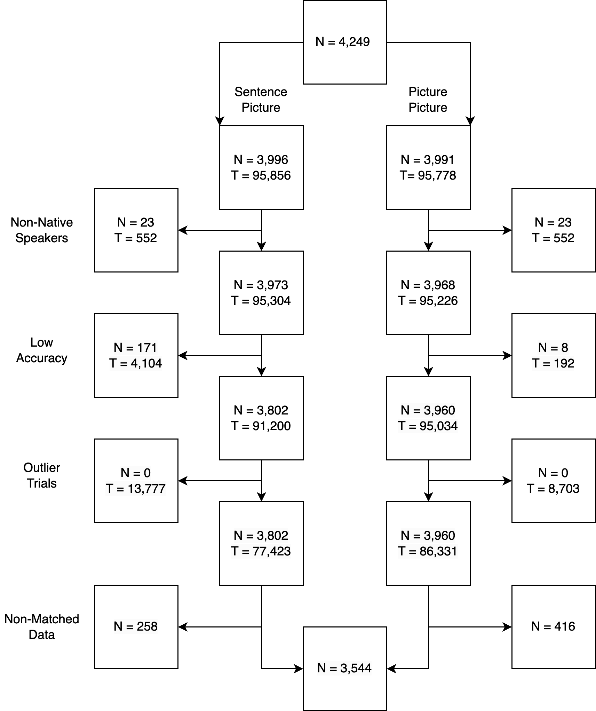
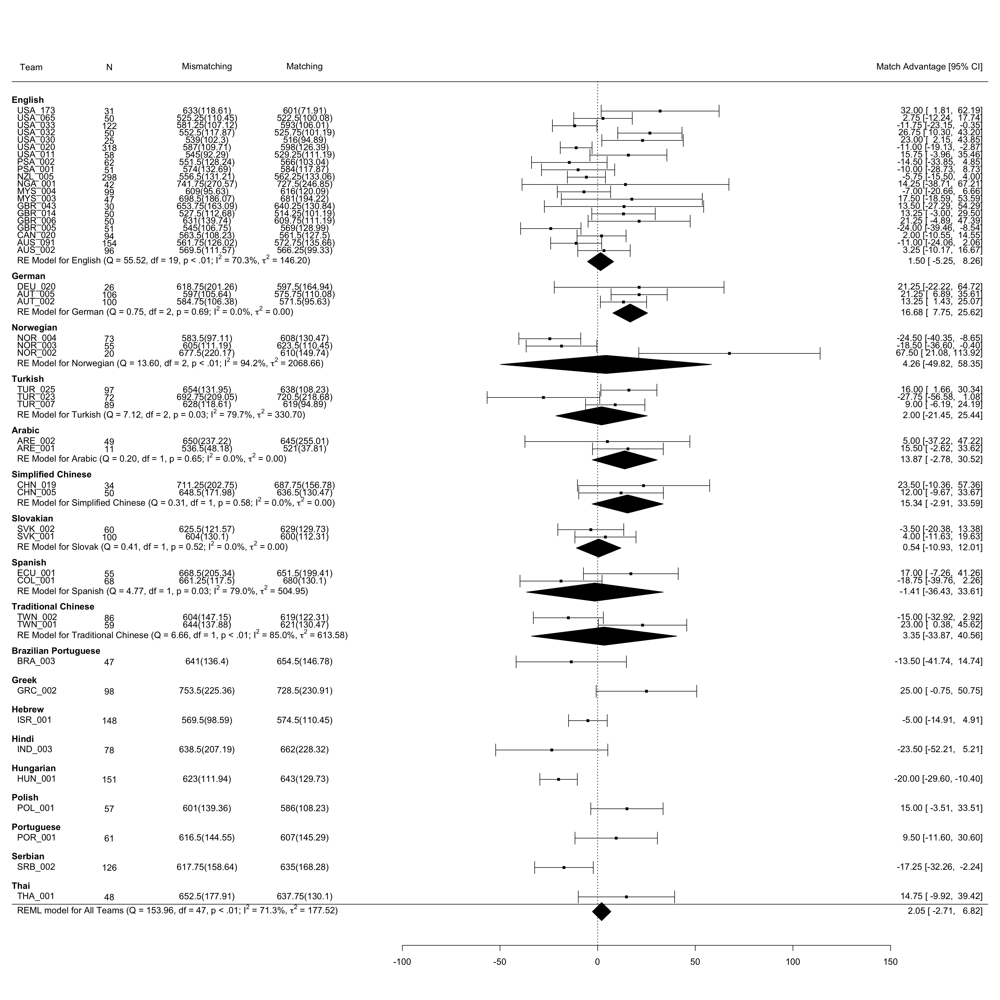

```{r setup, include = FALSE}
 knitr::opts_chunk$set(
	echo = FALSE,
	cache = TRUE
)
 # library(tidyverse)
 # library(data.table)
 # library(lubridate)
 # library(magrittr)
 # library(knitr)
 library(lme4)
 library(lmerTest)
 # library(parameters)
 library(metafor)
 # library(afex)
 # library(standardize)
 # library(sjPlot)
 library(dplyr)
 library(ggplot2)
 # library("kableExtra")
 library("papaja")
 library(rio)
 library(broom)
 library(broom.mixed)
 library(stringr)
 library(tidyr)
 # options(scipen=999)
 # library(rstatix)
 # library(tinytex)
 # tinytex::install_tinytex() # only necessary for this reproduction you would only need to run it once on your machine 
```

```{r trackdown, eval = F}
library(trackdown)
getwd()
# devtools::install_github("ClaudioZandonella/trackdown")
# initial set up 
# upload_file(file = "code/Stage2_Report_full.Rmd",
#       gfile = "Stage2_Report_trackdown",
#       gpath = "Studies/PSA002 Object Orientation/New Submission",
#       shared_drive = "Psychological Science Accelerator")
# from google 
download_file(file = "Stage2_Report_full.Rmd",
              # file = "code/Stage2_Report_full.Rmd",
      gfile = "Stage2_Report_trackdown",
      gpath = "Studies/PSA002 Object Orientation/New Submission",
      shared_drive = "Psychological Science Accelerator")
# to google
update_file(file = "Stage2_Report_full.Rmd",
            # file = "code/Stage2_Report_full.Rmd",
      gfile = "Stage2_Report_trackdown",
      gpath = "Studies/PSA002 Object Orientation/New Submission",
      shared_drive = "Psychological Science Accelerator",
      rich_text = TRUE,
      hide_code = TRUE)
```

```{r analysis-preferences}
# Seed for random number generation
set.seed(42)
knitr::opts_chunk$set(cache.extra = knitr::rand_seed)
```

```{r load_info, message = FALSE, warning = FALSE, include = FALSE}
# Load lab information
# https://osf.io/dtfcg
lab_info <- dir(path = "..", full.names = TRUE, recursive = TRUE,
  include.dirs = TRUE, pattern = "Lab_Info.csv") %>%
import()
# this part for code ocean
# lab_info <- import("includes/files/Lab_Info.csv")
```

Mental simulation of object properties is a major topic in conceptual processing research [@ostarekSixChallengesEmbodiment2019; @scorolli2014embodiment]. Theoretical frameworks of conceptual processing describe the integration of linguistic representations and situated simulation [e.g., reading about bicycles integrates the situation in which bicycles would be used, @barsalou_grounded_2008;
@zwaan_embodiment_2014]. Proponents of situated cognition contend that perceptual representations can be generated during language processing [@barsalouPerceptualSymbolSystems1999; @wilson2002], as cognition is thought to be an interaction of the body, environment, and processing [@barsalou2020]. Given this definition of situated cognition, it is important to investigate previously established embodied cognition effects across multiple environments (in this case, languages and cultures), especially as the credibility revolution has indicated that not all published findings are replicable [@vazire2018]. 

One empirical index of situated simulation is the mental simulation effect measured in the sentence-picture verification task (see Figure \@ref(fig:fig01)). This task requires participants to read a probe sentence displayed on the screen. On the following screen, participants see a picture of an object and must verify whether the object was mentioned in the probe sentence. Verification response times are used to test the mental simulation effect, which occurs when people are faster to respond to pictures that match the properties implied by the probe sentences. For example, the orientation implied by the sentence "*Tom hammered the nail into the wall*" would be matched if the following picture showed a horizontally-oriented nail rather than a vertically-oriented one. The opposite would be true of the sentence "*Tom hammered the nail into the floor plank.*".

```{r fig01, echo = FALSE, message = FALSE, warning = FALSE, out.width="100%", fig.cap = "Procedure of the sentence-picture verification task, with an example of matching orientation."}
knitr::include_graphics("includes/fig/fig2a.png")
```

Mental simulation effects have been demonstrated for object shape [@zwaanLanguageComprehendersMentally2002], color [@connellRepresentingObjectColour2007], and orientation [@stanfield_effect_2001]. Subsequent replication studies revealed consistent results for shape but inconsistent findings for color and orientation effects [@koning_mental_2017; @rommersObjectShapeOrientation2013; @zwaanRevisitingMentalSimulation2012]. Existing theoretical frameworks do not provide much guidance regarding the potential causes for this discrepancy. With the accumulating concerns about the lack of reproducibility [e.g., @kaschakEmbodimentLabTheory2021], researchers have found it challenging to reconcile the theory of mental simulation with the failures to replicate some of the effects [e.g., @morey2022]. In an empirical discipline like cognitive science, a theory requires the support of reproducible results.

The reliability of match advantage effects seems to vary depending on both the object properties and the languages under study. Mental simulation effects for object shape have consistently been found in English  [@zwaanEmbodiedSentenceComprehension2005; @zwaanParticipantNonnaiveteReproducibility2017; @zwaanRevisitingMentalSimulation2012], Chinese [@liERPStudyMental2017], Dutch [@engelenPerceptualSimulationDeveloping2011; @koning_mental_2017; @pecherLanguageComprehendersRetain2009; @rommersObjectShapeOrientation2013], German [@kosterMentalSimulationObject2018], Croatian [@seticNumericalCongruencyEffect2017], and Japanese [@satoOneWordTime2013]. Object orientation, on the other hand, has produced mixed results across languages: namely, positive evidence in English [@stanfield_effect_2001; @zwaanRevisitingMentalSimulation2012] and in Chinese [@chenDoesObjectSize2020], and null evidence in Dutch [@rommersObjectShapeOrientation2013; @koning_mental_2017] and in German as second language [@kosterMentalSimulationObject2018]. Among studies on shape and orientation, the effects of object orientation have been smaller than those of object shape (e.g., *d* = 0.10 vs. 0.17 in Zwaan &
Pecher, 2012; *d* = 0.07 vs. 0.27 in De Koning et al., 2017). To understand the causes for the discrepancies among object properties and languages, it is imperative to consider the cross-linguistic and experimental factors of the sentence-picture verification task.

## Cross-linguistic, Methodological, and Cognitive Factors

Several factors might contribute to cross-linguistic differences in the match advantage of object orientation. First, languages differ in how they encode motion and placement events in sentences [@newmanCrosslinguisticOverviewPosture2002; @verkerk2014]. Second, the potential role of mental rotation as a confound has been considered [@rommersObjectShapeOrientation2013]. We expand on how linguistic, methodological, and cognitive factors hinder the improvement of theoretical frameworks below.

**Linguistic Factors.** The probe sentences used in object orientation studies usually contain several motion events (e.g., "*The ant walked towards the pot of honey and tried to climb in*"). Languages encode motion events in different ways, and grammatical differences between lexical encodings could explain different match advantage results. According to @verkerk2014, Germanic languages (e.g., Dutch, English, and German) generally encode the manner of motion in the verb (e.g., "*The ant dashed*"), while conveying the path information through satellite adjuncts (e.g., "*towards the pot of honey*"). In contrast, other languages, such as the Romance family (e.g., Portuguese, Spanish), more often encode the path in the verb (e.g., "*crossing*", "*exiting*"). Crucially, past research on the match advantage of object orientation is exclusively based on Germanic languages, and yet, there were differences across those languages, with English being the only one that consistently yielded the match advantage. As a minor difference across Germanic languages in this regard, @verkerk2014 notes that path-only constructions (e.g., "*The ant went to the feast*") are more common in English than in other Germanic languages.

Another topic to be considered is the lexical encoding of placement in each language, as the stimuli contain several placement events (e.g., "*Sara situated the expensive plate on its holder on the shelf*"). @chenDoesObjectSize2020 and @kosterMentalSimulationObject2018 noted that some Germanic languages, such as German and Dutch, often make the orientation of objects more explicit than English. In English, for example, the verb "*put*" does not convey a specific orientation in the sentences "*She put the book on the table*" and "*She put the bottle on the table*." However, in German and Dutch, speakers preferred the verbs "*laid*" or "*stood*" in the above sentences. In this case, the verb "*lay*" encodes a horizontal orientation, whereas the verb "*stand*" encodes a vertical orientation. This distinction extends to verbs indicating existence. As @newmanCrosslinguisticOverviewPosture2002 exemplified, an English speaker would be likely to say "*There’s a lamp in the corner*," whereas a Dutch speaker would be more likely to say "*There 'stands' a lamp in the corner*." Nonetheless, we cannot conclude that these cross-linguistic differences are affecting the match advantage across languages because the current theories [e.g., Language and Situated Simulation,
@barsalou_grounded_2008] have not addressed the potential influence of linguistic aspects such as the lexical encoding of placement.

**Methodological factors.** Inconsistent findings on the match advantage of object orientation may be due to variability in task design. For example, studies failing to detect the match advantage may not have required participants to verify the probe sentence after the response to the target picture [see @zwaan_embodiment_2014]. Without such a verification, participants might have paid less attention to the meaning of the probe sentences, in which they would have been less likely to form a mental representation of the objects [e.g.,
@zwaanReadersConstructSpatial1993] In this regard, variability originating from differences in the characteristics of experiments can substantially influence the results [@barsalouEstablishingGeneralizableMechanisms2019;
@kaschakEmbodimentLabTheory2021].

**Cognitive Factors.** 

Since @stanfield_effect_2001 showed a match advantage of object orientation, later studies on this topic have examined the association between the match advantage and visual imagery rather than situated simulation. Visual imagery can be measured with indirect measurements such as vividness questionnaires [@zwaanRevisitingMentalSimulation2012] and via more direct measurements such as mental rotation tasks [@chenDoesObjectSize2020]. Indeed, studies have suggested that mental rotation tasks offer valid reflections of previous spatial experience [@frickMentalObjectRotation2013] and of current spatial cognition [@chuSpontaneousGesturesMental2008; @pouwMoreEmbeddedExtended2014]. Some previous studies have drawn on mental rotation to study mental simulation. For instance, @koning_mental_2017 observed that the effectiveness of mental rotation increased with the size of the depicted object. @chenDoesObjectSize2020 examined the implication of this finding for the match advantage of object orientation [@stanfield_effect_2001], and implemented a picture-picture verification task using the mental rotation paradigm [@cohenMentalRotationMental1993]. In each trial, two pictures appeared on opposite sides of the screen. Participants had to verify whether the pictures represented identical or different objects in which the two objects presented in congruent orientations (both are horizontal or vertical) or in incongruent orientations (one is horizontal and one is vertical). 

@chenDoesObjectSize2020 not only revealed shorter verification times for congruent orientations (i.e., two identical pictures presented in horizontal or vertical orientation) but also replicated the advantage for larger objects (i.e., "*pictures of bridges versus pictures of pens*"). The results were consistent across the three languages investigated—English, Dutch and Chinese. @chenDoesObjectSize2020 converted the picture-picture verification times to the mental rotation scores that were the discrepancy of verification times between the identical and different orientations. Their analysis showed that mental rotation affected the Dutch participants' sentence-picture verification performance. With the measurement of mental rotation scores[^1], we explore the association of spatial cognition and the effect of orientation in comprehension across the investigated languages.

[^1]: In the pre-registered plan, we used the term "imagery score" but
    this term was confusing. Therefore, we used "mental rotation scores"
    instead of "imagery scores" in the final report.

## Purposes of this study

To scrutinize the discrepancies in findings across languages and cognitive factors, we examined the reproducibility of the object orientation effect in a multi-lab collaboration. Our pre-registered plan aimed at detecting a general match advantage of object orientation across languages and evaluated the magnitude of match advantage in each specific language. Additionally, we examined whether the match advantages were related to the mental rotation index. Thus, this study followed the original methods from @stanfield_effect_2001 and addressed two primary questions: (1) How much of the match advantage of object orientation can be obtained within different languages, and (2) How are differences in the mental rotation index associated with the match advantage across languages?

# Method

## Hypotheses and Design

The study design for the sentence-picture and picture-picture verification tasks was mixed, using between-participant (language) and within-participant (match versus mismatch object orientation) independent variables. In the sentence-picture verification task, the match condition reflects a match between the sentence and the picture, whereas in the picture-picture verification it reflects a match in orientation between two pictures. The only dependent variable for both tasks was response time. The time difference between match conditions in each task is the measurement of mental simulation effects (for the sentence-picture task) and mental rotation scores (for the picture-picture task). We did not select languages systematically but instead based on our collaboration recruitment with the Psychological Science Accelerator [PSA, @moshontzPsychologicalScienceAccelerator2018].

We pre-registered the following hypotheses:

  (1)	In the sentence-picture verification task, we expected response times to be shorter for matching compared to mismatching orientations within each language. In the picture-picture verification task, we expected shorter response time for identical orientation compared to different orientations. We did not have any specific hypotheses about the relative size of the object orientation match advantage in different languages.
  (2) Based on the assumption that "*mental rotation is a general cognitive function*", we expect equal mental rotation scores across languages, but no association between mental rotation scores and mental simulation effects [see @chenDoesObjectSize2020].

```{r all_data, message = FALSE, warning = FALSE, include = FALSE, eval = T}
# Load raw SPV data 
# Build data frame of valid SP verification responses
all_files <- list.files(path = "../data",
                         pattern = ".csv", 
                         full.names = TRUE,
                         recursive = TRUE)
all_files <- all_files[grepl("PP|SP|jatos_results|pp|sp|Pp|Sp", all_files)]
all_files <- all_files[!grepl("CITATION", all_files)]
all_list <- list()
for (i in 1:length(all_files)){
  all_list[[i]] <- import(all_files[i])
  all_list[[i]]$unique_id <- all_files[i]
  
  all_list[[i]] <- all_list[[i]] %>% 
    mutate(across(everything(), as.character))
}
all_data <- bind_rows(all_list) %>% 
  select(subject_nr, 
         LAB_SEED, 
         datetime, 
         logfile, 
         task_order,
         List, 
         PList,
         Match,
         Orientation, 
         Probe,
         Target,
         response_time, 
         correct,
         PPList, 
         Orientation1,
         Orientation2, 
         Identical,
         Picture1,
         Picture2, 
         opensesame_codename,
         opensesame_version,
         unique_id,
         Task) %>% 
  filter(!is.na(opensesame_codename))
all_data$PSA_ID <- substr(all_data$unique_id, 9, 16)
all_data$PSA_ID <- gsub("\\/", "", all_data$PSA_ID)
all_data$subject_nr[na.omit(all_data$opensesame_codename != "osweb")] <- 
  gsub("../data/|SP|PP|_|-| |.csv", "", all_data$unique_id[na.omit(all_data$opensesame_codename != "osweb")])
SP_V <- all_data %>% select(
  PSA_ID, subject_nr, LAB_SEED, datetime, logfile, task_order, List,
  Match, Orientation, PList, Probe, Target, response_time, correct, 
  opensesame_codename, opensesame_version, Task) %>% 
  left_join(lab_info %>% select(PSA_ID, Language), by = "PSA_ID") %>% 
  readr::type_convert() %>% 
  distinct() %>% 
  mutate(Language = ifelse(Language == "Magyar", "Hungarian", Language)) %>% ## Switch "Magyar" to "Hungarian"
 mutate(Language = ifelse(Language == "Simple Chinese", "Simplified Chinese", Language)) %>% ## Switch "Simple Chinese" to "Simplified Chinese"
 mutate(PSA_ID = str_replace(PSA_ID, "SRB_002B", "SRB_002")) %>% ## Combine two Serbian language groups based on the collectors' recommendation
 mutate(Source = if_else(opensesame_codename == "osweb","osweb","site"), 
  Subject = paste0(Source,"_",PSA_ID,"_",subject_nr, "_", datetime)) %>% ## Compose the unique participant id
 subset(Match != "F") ## Exclude fillers in SP_V
# Build data frame of valid PP responses
PP <- all_data %>% select(
  PSA_ID, LAB_SEED, datetime, logfile, subject_nr, PPList, 
  Orientation1, Orientation2, Identical, Picture1, Picture2, 
  response_time, correct, opensesame_codename, opensesame_version, Task) %>% 
  left_join(lab_info %>% select(PSA_ID, Language), by = "PSA_ID") %>% 
  readr::type_convert() %>% 
  distinct() %>% 
  mutate(Language = ifelse(Language == "Magyar", "Hungarian", Language)) %>% ## Switch "Magyar" to "Hungarian"
  mutate(Language = ifelse(Language == "Simple Chinese", "Simplified Chinese", Language)) %>% ## Switch "Simple Chinese" to "Simplified Chinese"
  mutate(PSA_ID = str_replace(PSA_ID, "SRB_002B", "SRB_002")) %>% ## Combine two Serbian language groups based on the collectors' recommendation
  mutate(Source = if_else(opensesame_codename == "osweb","osweb","site"), 
  Subject = paste0(Source,"_",PSA_ID,"_",subject_nr, "_", datetime)) %>%  ## Compose the unique participant id
  filter(Identical != "F") # practice trials 
SP_V$Subject[SP_V$opensesame_codename != "osweb"] <-
  paste0(SP_V$Source[SP_V$opensesame_codename != "osweb"],
         "_",
         SP_V$PSA_ID[SP_V$opensesame_codename != "osweb"],
         "_",
         SP_V$subject_nr[SP_V$opensesame_codename != "osweb"])
PP$Subject[PP$opensesame_codename != "osweb"] <- paste0(PP$Source[PP$opensesame_codename != "osweb"],"_",PP$PSA_ID[PP$opensesame_codename != "osweb"],"_",PP$subject_nr[PP$opensesame_codename != "osweb"])
# this part for code ocean
# export(SP_V, "../data/SP_V.csv", row.names = FALSE)
# export(PP, "../data/PP.csv", row.names = FALSE)
# export(all_data, "../data/all_data.csv", row.names = FALSE)
```

```{r include = F, message = F, eval = F}
# this part for code ocean
SP_V <- import("../data/SP_V.zip")
PP <- import("../data/PP.zip")
all_data <- import("../data/all_data.zip")
```

```{r fix_part_id, message = FALSE, warning = FALSE, include = FALSE}
# PP$Subject[PP$Subject == "site_MYS_003_MYS003/MYS00324"] <- rep(c("site_MYS_003_MYS003/MYS00324", "site_MYS_003_MYS003/MYS00324_1"), each = 24)
SP_V$Subject[SP_V$Subject == "site_USA_173_USA173/USA17328"] <- c(rep("site_USA_173_USA173_28", 30), rep("site_USA_173_USA173/USA17328_1", 29))
# fix issues with duplicate trials 
SP_V <- SP_V %>% 
  filter(!duplicated(SP_V %>% select(Subject, Target)))
PP <- PP %>% 
  filter(!duplicated(PP %>% select(Subject, Picture1)))
# test subjects counts
SP_V_subjects <- SP_V %>% 
  group_by(Subject, PSA_ID) %>% 
  count() 
PP_subjects <- PP %>% 
  group_by(Subject, PSA_ID) %>% 
  count()
merge_subjects <- SP_V_subjects %>% 
  full_join(PP_subjects, by = "Subject") %>% 
  rename(SP_Data = n.x,
         PP_Data = n.y)
merge_subjects$PSA_ID.x[is.na(merge_subjects$PSA_ID.x)] <- merge_subjects$PSA_ID.y[is.na(merge_subjects$PSA_ID.x)]
merge_subjects$PSA_ID <- merge_subjects$PSA_ID.x
merge_subjects <- merge_subjects %>% select(-PSA_ID.x, -PSA_ID.y)
```

```{r import_gender}
osweb_meta <- dir(path = ".."
                 ,full.names = TRUE, recursive = TRUE,
                 include.dirs = TRUE, pattern = "jatos_meta.csv") %>%
 import() %>%
# this part for code ocean
# osweb_meta <- import("includes/files/jatos_meta.csv") %>%
  unique() %>% 
  mutate(Batch = str_replace(Batch, "SRB_002B", "SRB_002")) %>% 
  mutate(gender = ifelse(gender==1,"FEMALE",ifelse(gender==2,"MALE","MISSING"))) %>%
  # mutate(birth_year_tr = as.numeric(birth_year)) %>%
  mutate(birth_year_tr = as.numeric(gsub(birth_year,pattern="NA|x",replacement = ""))) %>%
  mutate(year = ifelse(birth_year_tr > 21 & !is.na(birth_year_tr), 1900 + birth_year_tr, 2000 + birth_year_tr)) %>%
  mutate(age = ifelse(!is.na(year),2021-year,NA)) %>%
  group_by(Batch) %>%
  summarise(N = n(), 
            Female_N = sum(gender=="FEMALE",na.rm = TRUE), 
            Male_N = sum(gender=="MALE", na.rm = T), 
            Age = mean(age, na.rm=TRUE), 
            AgeSD = sd(age, na.rm=TRUE), 
            Proficiency = mean(lang_prof),
            missing_age = sum(is.na(age)))
site_meta <- import("includes/files/insite_meta.csv") %>% 
  mutate(gender = ifelse(gender=="female","FEMALE",ifelse(gender=="male","MALE","MISSING"))) %>%
  unique() %>% 
  group_by(PSA_ID) %>% 
  summarize(N = n(), Female_N = sum(gender=="FEMALE", na.rm = TRUE), 
            Male_N = sum(gender=="MALE", na.rm = T), 
            Age = mean(age, na.rm=TRUE),
            AgeSD = sd(age, na.rm=TRUE), 
            missing_age = sum(is.na(age))
            )
merge_subjects <- merge_subjects %>% 
  group_by(PSA_ID) %>% 
  summarize(SP_N_trials = sum(SP_Data, na.rm = T),
            PP_N_trials = sum(PP_Data, na.rm = T),
            SP_N = length(na.omit(SP_Data)),
            PP_N = length(na.omit(PP_Data))) %>% 
  full_join(site_meta, by = "PSA_ID") %>% 
  full_join(osweb_meta, by = c("PSA_ID" = "Batch"))
merge_subjects <- merge_subjects %>% 
  group_by(PSA_ID) %>% 
  mutate(Overall_N_Gender = sum(c(N.x, N.y), na.rm = T),
         Overall_N_Female = sum(c(Female_N.x, Female_N.y), na.rm = T),
         Overall_N_Male = sum(c(Male_N.x, Male_N.y), na.rm = T),
         Overall_Age = mean(c(Age.x, Age.y), na.rm = T), 
         Overall_SD = mean(c(AgeSD.x, AgeSD.y), na.rm = T),
         Overall_Missing_Age = sum(c(missing_age.x, missing_age.y), na.rm = T)) %>% 
  left_join(lab_info %>% select(PSA_ID, Language) %>% unique(), by = "PSA_ID")
```

## Participants

We performed a pre-registered power analysis, which sought to achieve a power of 80% in a directional one-sample *t*-test. When an effect size of *d* = 0.20 was hypothesized, a sample size of *N* = 156 was required. Instead, for a hypothetical effect size *d* = 0.10, a sample size of *N* = 620 was required. In addition, a power analysis tailored to mixed-effects models was performed. The effect size hypothesized in this analysis was equal to that observed by @zwaanRevisitingMentalSimulation2012, and the number of items was 100 (i.e., 24 planned items nested within at least five languages). The result revealed that a sample size of *N* = 400 would be required to achieve a power of 90%. We expected laboratories to show differences in orientation effects, and therefore, the mixed effect analysis treated the laboratories as a random variable to account for different analyses. The laboratories were allowed to follow a secondary plan: a team collected at least their pre-registered minimum sample size (suggested 100 to 160 participants, most implemented 50), and then determine whether or not to continue data collection via Bayesian sequential analysis (stopping data collection if $BF_{10}$ = 10 or $\frac{1}{10}$)[^2].

[^2]: See details of power analysis in the pre-registered plan, pp. 13 - 15. https://osf.io/preprints/psyarxiv/t2pjv_v1.

We collected data in `r length(unique(SP_V$Language))` languages from `r length(unique(c(SP_V$PSA_ID, PP$PSA_ID)))` laboratories. Each laboratory chose a maximal sample size and an incremental n for sequential analysis before their data collection. Because the pre-registered power analysis did not align with the final analysis plan, we conducted a sensitivity analysis (See Appendix A) to determine the smallest effect size our study could reliably detect. The results indicated that our design was sufficiently sensitive to detect an orientation effect of 2.36 ms or larger as statistically significant. For comparison, the average difference was 44 ms in the @stanfield_effect_2001, 35 ms in @zwaanRevisitingMentalSimulation2012, 1 ms in @rommersObjectShapeOrientation2013, and 7 ms in
@dekoningSizeDoesMatter2017.

The original sample sizes are presented in Table \@ref(tab:sample-table) for the teams that provided raw data to the project. Data collection proceeded in two broad stages: initially we collected data in the laboratory. However, when the global COVID-19 pandemic made this practice impossible to continue, we moved data collection online. In total, `r format(length(unique(c(SP_V$Subject, PP$Subject))), scientific = FALSE, big.mark = ",")` unique participants completed the present study with `r format(length(unique(c(SP_V$Subject[SP_V$opensesame_codename != "osweb"], PP$Subject[PP$opensesame_codename != "osweb"]))), scientific = FALSE, big.mark = ",")` completing the in-person version and `r format(length(unique(c(SP_V$Subject[SP_V$opensesame_codename == "osweb"], PP$Subject[PP$opensesame_codename == "osweb"]))), scientific = FALSE, big.mark = ",")` completing the online version[^3]. The in-person version included `r length(unique(SP_V$PSA_ID[SP_V$opensesame_codename != "osweb"]))` research teams and the online version included `r length(unique(SP_V$PSA_ID[SP_V$opensesame_codename == "osweb"]))` with `r length(unique(SP_V$PSA_ID))` total teams across both data collection methods (i.e., some labs completed both in-person and online data collection). Based on recommendations from the research teams (Turkish lab: TUR_007, Taiwanese lab: TWN_002), two sets of data were excluded from all analyses due to participants being non-native speakers. Figure \@ref(fig:sample-fig) provides a flow chart for participant exclusion and inclusion for analyses. All participating laboratories had either ethical approval or institutional evaluation before data collection. All data and analysis scripts are available on the source files (https://codeocean.com/capsule/9287673). Appendix B summarizes the average characteristics by language and laboratory.

[^3]: Data for this study was collected together with another unrelated study [@phills_preregistration_2022] during the same data collection session, with the two studies using different data collection platforms. The demographic data was collected within the platform of the other study during the in-person sessions. Some participants only completed the Phills et al. study and dropped out without completing the present study, and there were also some data entry errors in the demographic data. Thus, the demographic data of some participants who took the present study are missing or unidentifiable (*n* = `r merge_subjects %>% filter(!(PSA_ID %in% unique(SP_V$PSA_ID))) %>% pull(Overall_N_Gender) %>% sum()` cannot be matched to a lab, *n* = `r format(sum(merge_subjects$Overall_N_Gender) - sum(c(merge_subjects$Overall_N_Female, merge_subjects$Overall_N_Male)), big.mark = ",")` were missing gender information, and *n* = `r sum(merge_subjects$Overall_Missing_Age)` were missing age information). Importantly, this does not affect the integrity of the experimental research data.

```{r sample-table, results = 'asis'}
merge_subjects %>% 
  arrange(Language) %>% 
  ungroup() %>% 
  filter(PSA_ID %in% unique(SP_V$PSA_ID)) %>%
  group_by(Language) %>% 
  summarize(SP_N_trials = sum(SP_N_trials, na.rm = T), 
            PP_N_trials = sum(PP_N_trials, na.rm = T), 
            SP_N = sum(SP_N, na.rm = T),
            PP_N = sum(PP_N, na.rm = T), 
            Overall_N_Gender = sum(Overall_N_Gender, na.rm = T), 
            Overall_N_Female = sum(Overall_N_Female, na.rm = T),
            Overall_N_Male = sum(Overall_N_Male, na.rm = T), 
            Overall_Age = mean(Overall_Age, na.rm = T), 
            Overall_SD = mean(Overall_SD, na.rm = T)) %>% 
  ungroup() %>% 
  select(Language, SP_N_trials, PP_N_trials, SP_N, PP_N, 
         Overall_N_Gender, Overall_N_Female, Overall_N_Male, 
         Overall_Age, Overall_SD) %>% 
  mutate(
    Overall_Age = format(round(Overall_Age, 2), nsmall = 2), 
    Overall_SD = format(round(Overall_SD, 2), nsmall = 2)
  ) %>% 
  mutate(Language = ifelse(Language == "Simple Chinese", "Simplified Chinese", Language)) %>% 
  apa_table(
 format = "latex",
 booktabs = TRUE,
 font_size = "footnotesize",
 col.names = c("Language", "$SP_{Trials}$",
               "$PP_{Trials}$", "$SP_N$", "$PP_N$", "$Demo_N$",
               "$Female_N$", "$Male_N$","$M_{Age}$", "$SD_{Age}$"),
 align = c("l", rep("c", 9)),
 caption = "Demographic and Sample Size Characteristics",
 note = "SP = Sentence Picture Verification, PP = Picture Picture Verification. Sample sizes for demographics may be higher than the sample size for the this study, as participants could have only completed the bundled experiment. Additionally, not all entries could be unambigously matched by lab ID, and therefore, demographic sample sizes could also be less than data collected."
 ) 
```

```{r exclude-nonnative}
SP_V_non <- SP_V %>% 
  filter(PSA_ID != "TUR_007E" & PSA_ID != "TWN_002E")
PP_non <- PP %>% 
  filter(PSA_ID != "TUR_007E" & PSA_ID != "TWN_002E")
```

```{r sample-fig, echo = FALSE, message = FALSE, warning = FALSE, results = 'asis', paged.print = TRUE, fig.cap = "Sample size and exclusions. N = number of unique participants, T = number of trials. The final combined sample was summarized to a median score for each match/mismatch condition, and therefore, includes one summary score per person."}

```

## Materials

**Sentences.** 24 critical sentence pairs (48 total sentences) were included in this study following @stanfield_effect_2001. Each pair consisted of versions that differed in their implied orientation of the object embedded in the sentence. For instance, the sentence "*The librarian put the book back on the table*" — which implies a horizontal orientation — had a counterpart in the sentence "*The librarian put the book back on the shelf*" — which implies a vertical orientation. Another two sets of 24 sentences were included as filler sentences for the task demand. These sentences were not matched to any particular orientation but included a potential object for depiction. For example, "*After a week the painting arrived by mail*", and "*The flowers that were planted last week had survived the storm*" were included as filler sentences. Each participant was shown 24 critical sentences and 24 filler sentences in the study. The filler sentences were included to counterbalance the number of yes-no answers to create an even 50% ratio.  

**Pictures.** The study included 24 critical matched pictures that only varied in their orientation (vertical/horizontal) for a total of 48 critical pictures [from @zwaanRevisitingMentalSimulation2012]. These pictures were matched to their respective sentences for implied orientation. "*The librarian put the book back on the table*" was matched with a horizontally oriented book, while "*The librarian put the book back on the shelf*" was matched with a vertically oriented book. For counterbalancing, the mismatch between picture orientation and sentence was created, and the book would be shown in the respective opposite orientation (see orientation pairs at https://osf.io/utqxb). Another 48 pictures from @zwaanRevisitingMentalSimulation2012 were included for the fillers which were unrelated to the corresponding sentence. Therefore, the answer to critical pairs was always "yes", while the filler sentence-picture combinations answer was always "no". 

**Picture-Picture Trials.** The picture-picture verification task used the same object pictures as the above task. The 24 critical picture pairs were included as match trials and were counterbalanced such as half the time they appeared with the same object and orientation (i.e., the same picture), and half the time with the opposite orientation (i.e., horizontal and vertical). The filler pictures were randomly paired to create mismatch trials. Table \@ref(tab:stim-table) shows the
counterbalancing and combinations for trials.

```{r stim-table, results = 'asis'}
data.frame(
  "Condition" = c("Sentence-Picture\nCritical\nMatch", 
                  "Sentence-Picture\nCritical\nMatch",
                  "Sentence-Picture\nCritical\nMismatch",
                  "Sentence-Picture\nCritical\nMismatch",
                  "Sentence-Picture\nFiller",
                  "Picture-Picture\nCritical\nMatch",
                  "Picture-Picture\nCritical\nMatch",
                  "Picture-Picture\nCritical\nMismatch",
                  "Picture-Picture\nCritical\nMismatch", 
                  "Picture-Picture\nFiller"), 
  "Item 1" = c("Critical Sentence:\nHorizontal",
               "Critical Sentence:\nVertical",
               "Critical Sentence:\nHorizontal",
               "Critical Sentence:\nVertical",
               "Sentence",
               "Critical Picture:\nHorizontal",
               "Critical Picture:\nVertical",
               "Critical Picture:\nHorizontal",
               "Critical Picture:\nVertical",
               "Picture"),
  "Item 2" = c("Critical Picture:\nHorizontal",
               "Critical Picture:\nVertical",
               "Critical Picture:\nVertical",
               "Critical Picture:\nHorizontal",
               "Picture",
               "Critical Picture:\nHorizontal",
               "Critical Picture:\nVertical",
               "Critical Picture:\nVertical",
               "Critical Picture:\nHorizontal",
               "Picture"),
  "Participant Answer" = c("Yes", "Yes", "Yes", "Yes","No", 
                           "Yes", "Yes", "Yes", "Yes", "No"),
  "Number" = c(6,6,6,6,24,
               6,6,6,6,24)
  ) %>% 
  mutate(Number = as.character(Number)) %>% 
  apa_table(
 format = "latex",
 booktabs = TRUE,
 font_size = "scriptsize",
 col.names = c("Condition", "Item 1", "Item 2", "Answer", "Number"),
 align = c(rep("l", 3), rep("c", 2)),
 caption = "Trial conditions for the Sentence-Picture and Picture-Picture Verification Task"
 ) 
```

## Procedure

**Sentence-Picture Task.** The sentence-picture verification task was always administered first. This task began with six practice trials. Each trial started with a left-aligned vertically centered fixation point displayed for 1,000 ms, immediately followed by the probe sentence. The sentence remained on the screen until the participant pressed the space key, acknowledging that they had read the sentence. Then, the object picture was presented in the center of the screen until the participant responded, or it disappeared after two seconds. Participants were instructed to verify, as quickly and accurately as possible, whether the object on screen had been mentioned in the probe sentence. Following @stanfield_effect_2001, a memory check test was carried out after every three to eight trials to ensure that participants had read each sentence carefully.

As shown in Table \@ref(tab:stim-table), the trials for the sentence-picture task were created by counterbalancing the sentence implied orientation (vertical, horizontal) by the pictured object orientation creating a fully crossed combination between matching sentences and objects. Therefore, each participant only saw one of the four possible combinations (sentence orientation 2 X object orientation 2). For the filler items, sentences and unrelated target pictures were randomly assigned in two separate lists. These fillers were included with the critical pairs but were excluded from the analysis. Stimuli lists were created in Excel, and this information can be found at https://osf.io/utqxb. 

**Translation of Sentences.** The translation of probe sentences followed our pre-registered plan. Every non-English language coordinator was required to recruit at least four translators who were fluent in both English and the target language. Every language coordinator supervised the translators using the Psychological Science Accelerator guidelines. In addition, the coordinator and participating laboratories consulted about each of the following points:

(1) Four translators could denote the items that are unfamiliar to a particular language based on object familiarity ratings. The two forward translators would suggest alternative probe sentences and object pictures to replace the unfamiliar objects. The two backward translators would evaluate the suggested items.

(2) Some objects in a particular language have different spellings or pronunciations among countries and geographical zones due to dialect. For example, American speakers tend to write "*tire*" whereas British speakers tend to write "*tyre*". Every coordinator would mark these local translations in the final version of translated materials. Participating laboratories could replace the names to match the local dialect.

**Picture-Picture Task.** Next, the picture-picture verification task was administered. In each trial, two objects appeared on either side of the central fixation point until either the participant indicated that the pictures displayed the same object or two different objects, or until two seconds elapsed. As shown in Table \@ref(tab:stim-table), four possible combinations of critical orientations could be shown with the picture (same, different) by orientation (same, different). Each participant only saw one of the critical combinations, and filler items were randomly paired in two combinations to match. The stimuli lists can be found at https://osf.io/utqxb.

**Software Implementation.** The study was executed using OpenSesame software for millisecond timing [@mathotOpenSesameOpensourceGraphical2012]. After data collection moved online, to minimize the differences between on-site and web-based studies, we converted the original Python code to Javascript and collected the data using OpenSesame through a JATOS server [@langeJustAnotherTool2015; @mathot_conducting_2022]. We proceeded with the online study from February to June 2021 after the changes in the procedure were approved by the journal editor and reviewers. Following the literature, we did not anticipate any theoretically important differences between the two data collection methods [@anwyl-irvineGorillaOurMidst2020; @bridgesTimingMegastudyComparing2020a; deleeuwPsychophysicsWebBrowser2016]. The instructions and experimental scripts are available at the public OSF folder (https://osf.io/e428p/ "Materials" in Files).

## Analysis Plan

To test Hypothesis 1, our first planned analysis[^4] used a random-effects meta-analysis model that estimated the match advantage across laboratories and languages. Analyses were restricted to correct responses on critical trials. Filler trials were excluded because they were not designed to test the match advantage, and incorrect responses were excluded because accuracy is a prerequisite for interpreting potential match-advantage effects. Other data considerations including participant level accuracy and outliers are discussed in the results section. The meta-analysis summarized the
median reaction times by match condition to determine the effect size by laboratory. The following formula was used:

[^4]: See the analysis plan in the pre-registered plan, p. 19 - 20. https://osf.io/preprints/psyarxiv/t2pjv_v1. This plan was changed to a random-effects model to ensure that we did not assume the exact same effect size for each language and lab. 


$$d = \frac{Mdn_{Mismatch} - Mdn_{Match}}{\sqrt{MAD_{Mismatch}^2 + MAD_{Match}^2-2\times r\times MAD_{Mismatch} \times MAD_{Match}}} \times \sqrt{2 \times (1-r)}$$

where $d$ is Cohen's $d$, $Mdn$ is Median, $MAD$ is median absolute deviation, and $r$ is correlation between match and mismatch condition. Meta-analytic effect sizes were computed for those languages that had data from more than one team.

Continuing to test Hypothesis 1, next, we ran planned mixed-effects models using correct response times from the critical trials of sentence-picture verification task as the dependent variable. In each analysis, we first built a simple linear regression model with a fixed intercept only. Then, we systematically added random intercepts and fixed effects, arriving at the final model. First, the random intercepts were added to the model one-by-one in the following order: participant ID, target, laboratory ID, and finally language. See below section for decision criteria for determining the final random-effect structure. Then, the fixed effect of matching condition (match vs. mismatch) was added to the model. Language-specific mixed-effects models were conducted in the same way if the meta-analysis showed a significant orientation effect.

According to the pre-registration, we planned to test Hypothesis 2 by first evaluating the equality of mental rotation scores across languages using an ANOVA. However, this plan was updated to use mixed models instead due to the nested structure of the data [@gelman_multilevel_2006]. The same analysis plan was used for model building and selection as described above for the sentence-picture verification task. To further assess Hypothesis 2, the last planned analysis was to use mental rotation scores for the prediction of mental stimulation with an interaction between language and mental rotation scores computed from the picture-picture task to determine if there were differences in prediction of match advantage in the sentence-picture task. Here, we used a mixed-effects model as well to control for the random effect of the data collection lab, and with language, mental rotation score, and their interaction as fixed effect predictors.

**Decision criterion for model selection and hypothesis testing.** The inclusion of both random and fixed effects in models was assessed using model comparison based on the Akaike information criterion (AIC). While this method is less conservative than alternatives such as the likelihood ratio test [@matuschek2017], the AIC was deemed appropriate due to the modest effect sizes that tend to be produced by mental simulation effects, and the limited sample sizes in the present study (albeit larger samples than those of most previous studies). Models with lower AIC were preferred over models with higher AIC, and in cases where the difference in AIC did not reach 2 [@burnham1998], the model with fewer parameters was preferred. 

p-values for each effect were calculated using the Satterthwaite approximation for degrees of freedom for individual predictor coefficients and meta-analysis [@lukeEvaluatingSignificanceLinear2017]. *p*-values were
interpreted using the pre-registered $\alpha$ level of .05.

**Intra-lab analysis during data collection.** Before data collection, each lab decided whether they wanted to apply a sequential analysis [@schonbrodtSequentialHypothesisTesting2017] or whether they wanted to settle for a fixed sample size. The pre-registered protocol for labs applying sequential analysis established that they could stop data collection upon reaching the pre-registered criterion ($BF_{10}$ = 10 or .10), or the maximal sample size. Each laboratory chose a fixed sample size and an incremental n for sequential analysis before their data collection. Two laboratories (Hungarian lab: HUN_001, Taiwanese lab: TWN_001) stopped data collection at the pre-registered criterion, $BF_{10}$ = .10. Fourteen laboratories did not finish the sequential analysis because (1) twelve laboratories were interrupted by the pandemic outbreak; (2) two laboratories (Turkish lab: TUR_007E, Taiwanese lab: TWN_002E) recruited English-speaking participants to comply with institutional policies. Lab-based records were reported on a public website as each laboratory completed data collection (details are available in Appendix C).

# Results

## Data Screening

```{r}
SP_V_acc_summary <- SP_V_non %>% 
  group_by(Subject) %>% 
  summarize(accuracy = sum(correct)/n())
SP_V_acc <- SP_V_non %>% 
  filter(Subject %in% (SP_V_acc_summary %>% 
                         filter(accuracy >=.70) %>% 
                         pull(Subject) %>% 
                         unique()))
PP_acc_summary <- PP_non %>% 
  group_by(Subject) %>% 
  summarize(accuracy = sum(correct)/n())
PP_acc <- PP_non %>% 
  filter(Subject %in% (PP_acc_summary %>% 
                         filter(accuracy >=.70) %>% 
                         pull(Subject) %>% 
                         unique()))

percent_acc <- length(unique(c(SP_V_non$Subject, PP_non$Subject))) - length(unique(c(SP_V_acc$Subject, PP_acc$Subject)))
percent_acc <- 

total_n <- length(unique(c(SP_V$Subject, PP$Subject)))
native_n <- length(unique(c(SP_V_non$Subject, PP_non$Subject)))
accuracy_n <- length(unique(c(SP_V_acc$Subject, PP_acc$Subject)))
```

As shown in Figure \@ref(fig:sample-fig), we recruited `r format(total_n, scientific = FALSE, big.mark = ",")` participants. After removing the non-native speakers ($n_{total}$ = `r format(total_n-native_n, scientific = FALSE, big.mark = ",")`, `r format(native_n, scientific = FALSE, big.mark = ",")` were then examined for accuracy. Following our pre-registered plan, participants' data were excluded from analyses of the sentence-picture and picture-picture tasks if their accuracy was below 70%. This threshold is common in research of this kind and helps ensure that the data reflect meaningful cognitive processing rather than random or inattentive responses. Overall, $n_{total}$ = `r native_n - accuracy_n` participants were removed for low accuracy across both tasks, leaving `r format(accuracy_n, scientific = FALSE, big.mark = ",")` participants. Figure \@ref(fig:sample-fig) indicates the sample sizes for each task. Please note that each task was examined separately, and participants were excluded when their accuracy was low for each task separately. 

```{r outliers}
SP_V_noout <- SP_V_acc %>% 
 group_by(Subject) %>% 
 mutate(MAD = mad(response_time),
  med = median(response_time),
  Outlier = response_time <= 160 | response_time >= (med + 2*MAD)) %>% 
  filter(Outlier == FALSE)
PP_noout <- PP_acc %>% 
 group_by(Subject) %>% 
 mutate(MAD = mad(response_time),
  med = median(response_time), 
  Outlier = response_time <= 160 | response_time >= (med + 2*MAD)) %>% 
  filter(Outlier == FALSE)

noout_n <- length(unique(c(SP_V_noout$Subject, PP_noout$Subject)))
matched_n <- length(intersect(SP_V_noout$Subject, PP_noout$Subject))
```

Next, the data were screened for outliers. Our pre-registered plan excluded outliers based on a linear mixed-model analysis for participants in the third quantile of the grand intercept (i.e., participants with the longest average response times). After examining the data from both online and in-person data collection, it became clear that both a minimum response latency and maximum response latency should be employed, as improbable times existed at both ends of the distribution. The minimum response time was set to 160 ms based on Hick’s Law [@kvalsethHickLawEquivalent2021; @proctorHickLawChoice2018]. The maximum response latency was calculated as two times the mean absolute deviation plus the median calculated separately for each participant. Exclusions were performed at the trial level for these outlier response times, and thus, $n_{total}$ = `r format(noout_n, scientific = FALSE, big.mark = ",")` participants were included in these analyses across both tasks (see Figure \@ref(fig:sample-fig) for separation *n*s for each task). After removal of non-native speakers and low-accuracy participants, `r format(matched_n, scientific = FALSE, big.mark = ",")` participants were included in analyses that required both sentence-picture and picture-picture response times.

```{r SP-source-lme, message = FALSE, warning = FALSE, include = FALSE}
SP_V_noout$r_Source <- SP_V_noout$opensesame_codename == "osweb"
source_cor.lmer <- lmerTest::lmer(
 response_time ~ Match*r_Source + 
 (1|Subject) + 
 (r_Source|PSA_ID) + 
 (r_Source|Language), 
 control = lmerControl(optimizer = "bobyqa",
   optCtrl = list(maxfun = 1e6)), 
 data = SP_V_noout)
source_cor_lmer_out <- summary(source_cor.lmer)
# summary(source_cor.lmer)
```

To ensure equivalence between data collection methods, we evaluated the response times predicted by the fixed effects of the interaction between match (match vs. mismatch) and data collection source (in-person vs. online). We included random intercepts for participants, lab, language, and random slopes for source by lab and source by language. This analysis showed no difference between data sources: *b* =
`r format(round(source_cor_lmer_out$coefficients[4,1], 2), nsmall = 2)`,
*SE* =
`r format(round(source_cor_lmer_out$coefficients[4,2], 2), nsmall = 2)`,
*t*(`r format(round(source_cor_lmer_out$coefficients[4,3], 2), nsmall = 2)`)
=
`r format(round(source_cor_lmer_out$coefficients[4,4], 2), nsmall = 2)`,
*p* = `r  apa_p(source_cor_lmer_out$coefficients[4,5])`. Therefore, the following analyses did not separate in-person and online data. Table \@ref(tab:summary-languages) provides a summary of the match advantage by language for the sentence-picture verification task.

```{r limitations, message=FALSE, warning=FALSE, include=FALSE}
SP_V_correct_temp <- SP_V_noout %>% 
  filter(correct == 1)
SP_M_out <- all_data %>% 
  filter(Task == "M" | Task == "Prac") %>% 
  left_join(lab_info %>% select(PSA_ID, Language), by = "PSA_ID") %>% 
  readr::type_convert() %>% 
  distinct() %>% 
  mutate(Language = ifelse(Language == "Magyar", "Hungarian", Language)) %>% ## Switch "Magyar" to "Hungarian"
 mutate(Language = ifelse(Language == "Simple Chinese", "Simplified Chinese", Language)) %>% ## Switch "Simple Chinese" to "Simplified Chinese"
 mutate(PSA_ID = str_replace(PSA_ID, "SRB_002B", "SRB_002")) %>% ## Combine two Serbian language groups based on the collectors' recommendation
 mutate(Source = if_else(opensesame_codename == "osweb","osweb","site"), 
  Subject = paste0(Source,"_",PSA_ID,"_",subject_nr, "_", datetime)) %>% ## Compose the unique participant id
  filter(PSA_ID %in% SP_V_correct_temp$PSA_ID) %>% 
  group_by(Source, Subject) %>% 
  summarise(M_acc = mean(correct)) 
t_test <- t.test(SP_M_out$M_acc ~ SP_M_out$Source, 
                 var.equal = FALSE, paired = FALSE)
```

Although we combined the two data sets in the final data analysis, it is worth considering that online participants' attention may be easily distracted given the lack of environmental control and experimenter overview. However, this secondary task revealed that online participants had a higher percent correct than in-person participants,
*t*(`r apa_num(t_test$parameter)`) = `r apa_num(t_test$statistic)`, *p*
`r apa_p(t_test$p.value)`, $M_{online}$ =
`r apa_num(mean(SP_M_out$M_acc[SP_M_out$Source == "osweb"], na.rm = T)*100)`
(*SD* =
`r apa_num(sd(SP_M_out$M_acc[SP_M_out$Source == "osweb"], na.rm = T)*100)`)
and $M_{in-person}$ =
`r apa_num(mean(SP_M_out$M_acc[SP_M_out$Source == "site"], na.rm = T)*100)`
(*SD* =
`r apa_num(sd(SP_M_out$M_acc[SP_M_out$Source == "site"], na.rm = T)*100)`).

```{r summary-languages, echo = FALSE, message = FALSE, warning = FALSE, paged.print = TRUE, results = 'asis'}
# Table in the final report.
# Summarize the participants' accuracy by language.
SP_V_noout %>% 
  group_by(Language, Subject) %>% 
  summarize(accuracy = sum(correct)/n()) %>% 
  group_by(Language) %>% 
  summarize(mean_ACC = format(round(mean(accuracy)*100, digits = 2), nsmall = 2)) %>% 
  left_join(
    SP_V_noout %>% 
      filter(correct == 1) %>% 
      group_by(Language, Subject, Match) %>%
   summarise(subject_M = median(response_time)) %>%
   group_by(Language, Match) %>%
   summarise(med_RT = median(subject_M), MAD_RT = mad(subject_M)) %>%
   pivot_wider(names_from = Match, values_from = c(med_RT, MAD_RT)) %>%
   mutate(Effect = (med_RT_N - med_RT_Y) ) %>%
   transmute(Mismatch_stat = paste0(
     format(round(med_RT_N, digits = 2), nsmall = 2),
     " (", format(round(MAD_RT_N, digits = 2), nsmall = 2),")"),
    Match_stat = paste0(
      format(round(med_RT_Y, digits = 2), nsmall = 2), 
      " (",format(round(MAD_RT_Y, digits = 2), nsmall = 2),")"),
    Effect = Effect) %>%
     mutate(Language = ifelse(Language == "Simple Chinese", "Simplified Chinese", Language)) %>% 
   arrange(desc(Language)),
   by = c("Language") 
  ) %>% 
 apa_table( 
 format = "latex",
 booktabs = TRUE,
 escape = FALSE,
 col.names = c("Language","Accuracy Percent","Mismatching","Matching","Match Advantage"),
 align = c("l",rep("c",4)),
 caption = "Descriptive Summary of Sentence-Picture Verification Task by Language",
 note = "Average accuracy percentage, Median response times and median absolute deviations (in parentheses) per match condition (Mismatching, Matching); Match advantage (difference in response times)."
 ) 
```

## Hypothesis 1: Meta-Analysis of the Orientation Effect

```{r}
SP_V_correct <- SP_V_noout %>% 
  filter(correct == 1)
PP_correct <- PP_noout %>% 
  filter(correct == 1)
```

```{r meta_setup, message = FALSE, warning = FALSE, include = FALSE}
## Prepare the data sets for the meta analysis
SP_V_meta_data <- SP_V_correct %>% 
 group_by(Language, PSA_ID, Subject, Match) %>%
 summarize(RT = median(response_time)) %>%
 pivot_wider(
 names_from = Match,
 values_from = c(RT)
 ) %>%
 group_by(Language, PSA_ID) %>%
 summarise(m_match = median(Y,na.rm = TRUE),
           m_mismatch = median(N,na.rm = TRUE),
           sd_match = mad(Y,na.rm = TRUE),
           sd_mismatch = mad(N,na.rm = TRUE),
           ni = n(),
           ri = cor(Y, N)) 
```

```{r meta-plot, echo = F, include = F, message = F, warning=FALSE}
### a little helper function to add Q-test, I^2, and tau^2 estimate info
mlabfun <- function(text, res) {
 list(bquote(paste(.(text),
   " (Q = ", .(formatC(res$QE, digits = 2, format = "f")),
   ", df = ", .(res$k - res$p),
   ", p ", .(metafor:::.pval(res$QEp, digits = 2, showeq = TRUE, sep = " ")), "; ",
   I^2, " = ", .(formatC(res$I2, digits = 1, format = "f")), "%, ",
   tau^2, " = ", .(formatC(res$tau2, digits = 2, format = "f")), ")")))}
# calculate effect size
SP_V_es <- escalc(measure = "MC", 
                  m1i = m_mismatch, 
                  m2i = m_match, 
                  sd1i = sd_mismatch, 
                  sd2i = sd_match,
                  ni = ni, 
                  ri = ri, 
                  slab = PSA_ID, 
                  data = SP_V_meta_data[
                    c(4:23, 24:26, 31:33, 46:48, 1:2, 37:38, 39:40, 41:42, 
                      44:45, 3, 27, 28, 29, 30, 34, 35, 36, 43),
                  ])
SP_V_meta_all <- rma.uni(yi, vi, data = SP_V_es, method = "REML", digits = 2)
{
  ## save the plot
  png(file = "includes/fig/meta-all.png", width=1400*3, height=1400*3, res = 225)
  
  forest(SP_V_meta_all,
   xlim = c(-300, 200), 
    olim = c(-100, 125),
   ilab = cbind(ni, 
                paste0(round(m_mismatch,2),
                      "(",round(sd_mismatch,2),")"), 
                paste0(round(m_match,2),
                       "(",round(sd_match,2),")")), 
   ilab.xpos = c(-250,-200,-150), 
   ylim = c(-1,40+4*17+6), 
   rows = c(
     21:40+4*17, # English
    18:20+4*16, # Germany
    15:17+4*15, # Norway
    12:14+4*14, # Turkish
    10:11+4*13, # Arabic
    8:9+4*12, # Simplified Chinese
    6:7+4*11, # Slovak
    4:5+4*10, # Spanish
    2:3+4*9, # Traditional Chinese
    1+4*8,  # Brazilian Portuguese
    1+4*7,  # Greek
    1+4*6,  # Hebrew
    1+4*5,  # Hindi
    1+4*4,  # Hungarian
    1+4*3,  # Polish
    1+4*2,  # Portuguese
    1+4,  # Serbian
    1  # Thai
   ), 
   mlab = mlabfun("REML model for All Teams", SP_V_meta_all),
   xlab = "", psize = 0.7)
  
  ### set font expansion factor (as in forest() above) and use a bold font
    op <- par(cex = 1, font = 1)
    ### add additional column headings to the plot
    text(c(-290,-250,-200,-150,170),39+4*17+7,c("Team","N","Mismatching","Matching" ,"Match Advantage [95% CI]"))
  ### switch to bold italic font
  par(font = 2)
  ### add text for the subgroups
  text(-300, c(40+4*17, # English
    20+4*16, # Germany
    17+4*15, # Norway
    14+4*14, # Turkish
    11+4*13, # Arabic
    9+4*12, # Simplified Chinese
    7+4*11, # Slovak
    5+4*10, # Spanish
    3+4*9, # Traditional Chinese
    1+4*8,  # Brazilian Portuguese
    1+4*7,  # Greek
    1+4*6,  # Hebrew
    1+4*5,  # Hindi
    1+4*4,  # Hungarian
    1+4*3,  # Polish
    1+4*2,  # Portuguese
    1+4,  # Serbian
    1  # Thai
    ) + 2, #pos = 2, 
    adj = c(0,1),
      c("English",
      "German",
      "Norwegian",
      "Turkish",
      "Arabic",
      "Simplified Chinese",
      "Slovakian",
      "Spanish",
      "Traditional Chinese",
      "Brazilian Portuguese",
      "Greek",
      "Hebrew",
      "Hindi",
      "Hungarian",
      "Polish",
      "Portuguese",
      "Serbian",
      "Thai"))
  
  ### set par back to the original settings
  par(op)
  ### fit fixed-effects model in the language groups
  res.English <- rma.uni(yi, vi, subset = (Language == "English"), data = SP_V_es, method = "REML", digits = 2)
  res.Germany <- rma.uni(yi, vi, subset = (Language == "German"), data = SP_V_es, method = "REML", digits = 2)
  res.Norway <- rma.uni(yi, vi, subset = (Language == "Norwegian"), data = SP_V_es, method = "REML", digits = 2)
  res.Turkish <- rma.uni(yi, vi, subset = (Language == "Turkish"), data = SP_V_es, method = "REML", digits = 2)
  res.Arabic <- rma.uni(yi, vi, subset = (Language == "Arabic"), data = SP_V_es, method = "REML", digits = 2)
  #res.Serbian <- rma.uni(yi, vi, subset = (Language == "Serbian"), data = SP_V_es, method = "REML", digits = 2)
  res.SC <- rma.uni(yi, vi, subset = (Language == "Simplified Chinese"), data = SP_V_es, method = "REML", digits = 2)
  res.Slovak <- rma.uni(yi, vi, subset = (Language == "Slovak"), data = SP_V_es, method = "REML", digits = 2)
  res.Spanish <- rma.uni(yi, vi, subset = (Language == "Spanish"), data = SP_V_es, method = "REML", digits = 2)
  res.TC <- rma.uni(yi, vi, subset = (Language == "Traditional Chinese"), data = SP_V_es, method = "REML", digits = 2)
  
  ### add summary polygons for the three subgroups
  addpoly(res.English, row = 21+4*17-1.5, mlab = mlabfun("RE Model for English", res.English))
  addpoly(res.Germany, row = 18+4*16-1.5, mlab = mlabfun("RE Model for German", res.Germany))
  addpoly(res.Norway, row = 15+4*15-1.5, mlab = mlabfun("RE Model for Norwegian", res.Norway))
  addpoly(res.Turkish, row = 12+4*14-1.5, mlab = mlabfun("RE Model for Turkish", res.Turkish))
  addpoly(res.Arabic, row = 10+4*13-1.5, mlab = mlabfun("RE Model for Arabic", res.Arabic))
  addpoly(res.SC, row = 8+4*12-1.5, mlab = mlabfun("RE Model for Simplified Chinese", res.SC))
  addpoly(res.Slovak, row = 6+4*11-1.5, mlab = mlabfun("RE Model for Slovak", res.Slovak))
  addpoly(res.Spanish, row = 4+4*10-1.5, mlab = mlabfun("RE Model for Spanish", res.Spanish))
  addpoly(res.TC, row = 2+4*9-1.5, mlab = mlabfun("RE Model for Traditional Chinese", res.TC))
  dev.off()
}
```

```{r meta-all-plot, echo = FALSE, out.width="100%", out.height="90%",  fig.cap = "Meta-analysis on match advantage of object orientation for all languages. Diamonds indicate summary estimates, the midpoint of the diamond indicating the point estimate, and the left and right endpoints indicating the lower and upper bounds of the confidence interval of the estimated effect size. The lowermost diamond represents the estimate derived from the whole dataset."}

```

The planned meta-analysis examined the effect overall and within
languages wherein at least two laboratories had collected data (Arabic,
English, German, Norway, Simplified Chinese, Traditional Chinese,
Slovakian, and Turkish). Figure \@ref(fig:meta-all-plot) showed a
significant positive orientation effect across German laboratories (*b*
= `r as.character(round(res.Germany$b,2))`, 95% CI
[`r as.character(round(res.Germany$ci.lb,2))`,
`r as.character(round(res.Germany$ci.ub,2))`]) but did not reveal a
significant overall effect (*b* =
`r as.character(round(SP_V_meta_all$b,2))`, 95% CI
[`r as.character(round(SP_V_meta_all$ci.lb,2))`,
`r as.character(round(SP_V_meta_all$ci.ub,2))`]). Also, a significant
negative orientation effect was found in the Hungarian (*b* = -20.00,
95% CI [-29.60, -10.40]) and the Serbian laboratory (*b* = -17.25, 95%
CI [-32.26, -2.24]), although in these languages only a single
laboratory participated, so no language-specific meta-analysis was
conducted.

## Hypothesis 1: Mixed-Linear Modeling of the Orientation Effect

```{r SP-lang-lme, message = FALSE, warning = FALSE, include = FALSE}
SP_V_correct$Match <- factor(SP_V_correct$Match, 
                             levels = c("Y", "N"))
# Null effect models
#only intercept
intercept.model <- lm(response_time ~ 1, 
   data = SP_V_correct)
#add random intercept of subject
subject.model <- lmer(response_time ~ 1 + (1|Subject), 
   control = lmerControl(optimizer = "bobyqa",
      optCtrl = list(maxfun = 1e6)), 
   data = SP_V_correct)
# add random intercept of item
item.model <- lmer(response_time ~ 1 + (1|Subject) + (1|Target), 
   control = lmerControl(optimizer = "bobyqa",
      optCtrl = list(maxfun = 1e6)), 
   data = SP_V_correct)
# add random intercept of lab
lab.model <- lmer(response_time ~ 1 + (1|Subject) + (1|Target) + (1|PSA_ID), 
   control = lmerControl(optimizer = "bobyqa",
      optCtrl = list(maxfun = 1e6)), 
   data = SP_V_correct)
# add random intercept of language
language.model <- lmer(response_time ~ 1 + (1|Subject) + (1|Target) + (1|PSA_ID) + (1|Language), 
   control = lmerControl(optimizer = "bobyqa",
      optCtrl = list(maxfun = 1e6)), 
   data = SP_V_correct)
# add fixed effects 
fixed.model <- lmer(response_time ~ Match + (1|Subject) + (1|Target) + (1|PSA_ID), 
   control = lmerControl(optimizer = "bobyqa",
      optCtrl = list(maxfun = 1e6)), 
   data = SP_V_correct)
SP_lme01_out <- summary(fixed.model)$coefficients
```

First, an intercept-only model of response times with no random
intercepts was computed for comparison purposes AIC =
`r format(round(AIC(intercept.model), digits = 2), nsmall = 2)`. The
model with the random intercept by participants was an improvement over
this model, AIC =
`r format(round(AIC(subject.model), digits = 2), nsmall = 2)`. The
addition of a target random intercept improved model fit over the
participant intercept-only model, AIC =
`r format(round(AIC(item.model), digits = 2), nsmall = 2)`. Data
collection lab was then added to the model as a random intercept, also
showing model improvement, AIC =
`r format(round(AIC(lab.model), digits = 2), nsmall = 2)`, and the
random intercept of language was added last, AIC =
`r format(round(AIC(language.model), digits = 2), nsmall = 2)` which did
not show model improvement at least 2 points change. Last, the fixed
effect of match advantage was added with approximately the same fit as
the three random-intercept model, AIC =
`r format(round(AIC(fixed.model), digits = 2), nsmall = 2)`. This model
did not reveal a significant effect of match advantage: *b* =
`r format(round(SP_lme01_out[2, 1], digits = 2), nsmall = 2)`, *SE* =
`r format(round(SP_lme01_out[2,2], digits = 2), nsmall = 2)`,
*t*(`r format(round(SP_lme01_out[2,3], digits = 2), nsmall = 2)`) =
`r format(round(SP_lme01_out[2,4], digits = 2), nsmall = 2)`, *p* =
`r apa_p(SP_lme01_out[2, 5])`.

```{r SP-ger-lme, message = FALSE, warning = FALSE, include = FALSE}
# add random intercept of lab
german.lab.model <- lmer(response_time ~ 1 + (1|Subject) + (1|Target) + (1|PSA_ID), 
   control = lmerControl(optimizer = "bobyqa",
      optCtrl = list(maxfun = 1e6)), 
   data = subset(SP_V_correct, Language == "German"))
german.fixed.three.model <- lmer(response_time ~ Match + (1|Subject) + (1|Target) + (1|PSA_ID) , 
   control = lmerControl(optimizer = "bobyqa",
      optCtrl = list(maxfun = 1e6)), 
   data = subset(SP_V_correct, Language == "German"))
german_output <- summary(german.fixed.three.model)$coefficients
```

We conducted an exploratory mixed-effects model on German data as this
was the only language where the confidence interval did not overlap with
a zero effect in the meta-analysis. An intercept-only model with random
effects for participants, target, and lab was used as a comparison, AIC
= `r format(round(AIC(german.lab.model), digits = 2), nsmall = 2)`. The
addition of the fixed effect of match showed a small improvement over
this random-intercept model, AIC =
`r format(round(AIC(german.fixed.three.model), digits = 2), nsmall = 2)`.
Whereas the AIC values indicated a better fit for the model including
matching orientation as a predictor, the advantage provided by matching
orientation was small: *b* =
`r format(round(german_output[2, 1], digits = 2), nsmall = 2)`, *SE* =
`r format(round(german_output[2,2], digits = 2), nsmall = 2)`,
*t*(`r format(round(german_output[2,3], digits = 2), nsmall = 2)`) =
`r format(round(german_output[2,4], digits = 2), nsmall = 2)`, *p* =
`r apa_p(german_output[2, 5])`. All the details of the above fixed
effects and random intercepts are summarized in Appendix D.

## Hypothesis 2: Mental Rotation Scores

```{r PP-null-lme, message = FALSE, warning = FALSE, include = FALSE}
PP_correct$Identical <- factor(PP_correct$Identical, 
                               levels = c("Y", "N"))
PP.intercept.lme <- lm(response_time ~ 1,
   data = PP_correct) 
PP.subject.lme <- lmerTest::lmer(response_time ~ 1 +
   (1 | Subject), # By-subject random intercept
  data = PP_correct,
   control = lmerControl(optimizer = "bobyqa",
                         optCtrl = list(maxfun = 1e6)) # Increase maximum number of iterations to facilitate model convergence 
   ) 
PP.item.lme <- lmerTest::lmer(response_time ~ 1 +
   (1 | Subject) + # By-subject random intercept
   (1 | Picture1), # By-item random intercept
  data = PP_correct,
   control = lmerControl(optimizer = "bobyqa",
                         optCtrl = list(maxfun = 1e6)) # Increase maximum number of iterations to facilitate model convergence 
   ) 
PP.lab.lme <- lmerTest::lmer(response_time ~ 1 +
   (1 | Subject) + # By-subject random intercept
   (1 | Picture1) + # By-item random intercept
   (1 | PSA_ID), # By-lab random intercept
   data = PP_correct,
   control = lmerControl(optimizer = "bobyqa", 
                         optCtrl = list(maxfun = 1e6)) # Increase maximum number of iterations to facilitate model convergence 
   ) 
PP.lang.lme <- lmerTest::lmer(response_time ~ 1 +
   (1 | Subject) + # By-subject random intercept
   (1 | Picture1) + # By-item random intercept
   (1 | PSA_ID) + # By-lab random intercept
   (1 | Language),
   data = PP_correct,
   control = lmerControl(optimizer = "bobyqa", 
                         optCtrl = list(maxfun = 1e6)) # Increase maximum number of iterations to facilitate model convergence 
   ) 
PP.fixed.lme <- lmerTest::lmer(response_time ~ 1 +
   (1 | Subject) + # By-subject random intercept
   (1 | Picture1) + # By-item random intercept
   (1 | PSA_ID) + # By-lab random intercept
   (1 | Language) + 
     Identical,
   data = PP_correct,
   control = lmerControl(optimizer = "bobyqa", 
                         optCtrl = list(maxfun = 1e6)) # Increase maximum number of iterations to facilitate model convergence 
   ) 
PP_output <- summary(PP.fixed.lme)$coefficients
lang_results <- data.frame(
  Language = unique(PP_correct$Language), 
  Coefficient = rep(NA, length(unique(PP_correct$Language))),
  SE = rep(NA, length(unique(PP_correct$Language)))
)
for (language in unique(PP_correct$Language)) {
  
  temp <- lmerTest::lmer(response_time ~ 1 +
   (1 | Subject) + # By-subject random intercept
   (1 | Picture1) + # By-item random intercept
     Identical,
   data = PP_correct %>% filter(Language == language),
   control = lmerControl(optimizer = "bobyqa", 
                         optCtrl = list(maxfun = 1e6)) # Increase maximum number of iterations to facilitate model convergence 
   ) 
  
  temp_table <- tidy(temp)
  lang_results$Coefficient[lang_results$Language == language] <- temp_table$estimate[2]
  lang_results$SE[lang_results$Language == language] <- temp_table$std.error[2]
  
}
min(lang_results$Coefficient)
max(lang_results$Coefficient)
```

Using the same steps as described for the sentence-picture verification
mixed model, we first started with an intercept-only model with no
random effects for comparison, AIC =
`r format(round(AIC(PP.intercept.lme), digits = 2), nsmall = 2)`. The
addition of random intercepts by subject, AIC =
`r format(round(AIC(PP.subject.lme), digits = 2), nsmall = 2)`, by item,
AIC = `r format(round(AIC(PP.item.lme), digits = 2), nsmall = 2)`, by
lab, AIC = `r format(round(AIC(PP.lab.lme), digits = 2), nsmall = 2)`,
and by language, AIC =
`r format(round(AIC(PP.lang.lme), digits = 2), nsmall = 2)`, all
subsequently improved model fit. Next, the match effect for object
orientation was entered as the fixed effect for mental rotation score,
AIC = `r format(round(AIC(PP.fixed.lme), digits = 2), nsmall = 2)`,
which showed improvement over the random intercepts model. This model
showed a significant effect of object orientation, *b* =
`r format(round(PP_output[2, 1], digits = 2), nsmall = 2)`, *SE* =
`r format(round(PP_output[2,2], digits = 2), nsmall = 2)`,
*t*(`r format(round(PP_output[2,3], digits = 2), nsmall = 2)`) =
`r format(round(PP_output[2,4], digits = 2), nsmall = 2)`, *p*
`r apa_p(PP_output[2, 5])`, such that identical orientations were
processed faster than rotated orientations. The point estimates of the
orientation effect varied between 23.79-40.24, revealing a range of 14 ms across languages. The coefficients of all mixed-effects models are
reported in Appendix E, along with all estimates presented by language.

## Hypothesis 2: Prediction of Match Advantage

```{r prediction_data, message=FALSE, warning=FALSE, include=FALSE}
## Dataset for prediction model
model_data <- PP_correct %>% 
  group_by(Language, Subject, Identical) %>%
  summarise(subject_M = median(response_time)) %>% 
  pivot_wider(names_from = Identical, values_from = subject_M) %>%
  mutate(Imagery = (N - Y)) %>% 
  full_join(
    SP_V_correct %>% 
      group_by(Language, Subject, Match) %>%
      summarise(subject_M = median(response_time)) %>% 
      pivot_wider(names_from = Match, values_from = c(subject_M)) %>%
  mutate(Effect = (N - Y)), 
    by = c("Language", "Subject")
  ) %>% 
  left_join(
    bind_rows(SP_V_correct, PP_correct) %>% 
      select(PSA_ID, Subject) %>% 
      unique(), 
    by = "Subject"
  )  %>% select(PSA_ID, Effect, Language, Imagery) %>% 
  na.omit()
```

```{r prediction_model, message=FALSE, warning=FALSE, include=FALSE}
model_data$Language <- factor(model_data$Language, 
                              levels = unique(model_data$Language)[c(3, 1:2, 4:17)])
pred.intercept <- lm(Effect ~ 1, 
                     data = model_data)
pred.lab <- lmer(Effect ~ 1 + (1|PSA_ID), 
                control = lmerControl(optimizer = "bobyqa",
                           optCtrl = list(maxfun = 1e6)), 
                               data = model_data)
pred.interact <- lmer(Effect ~ Language*Imagery + (1|PSA_ID), 
                control = lmerControl(optimizer = "bobyqa",
                           optCtrl = list(maxfun = 1e6)), 
                               data = model_data)
pred_output <- summary(pred.interact)$coefficients
```

The last analysis included a mixed effects regression model using the
interaction of language and mental rotation scores to predict match
advantage in the sentence-picture task. First, an intercept-only model
was calculated for comparison, AIC =
`r format(round(AIC(pred.intercept), digits = 2), nsmall = 2)`, which
was improved slightly by adding a random intercept by data collection
lab, AIC = `r format(round(AIC(pred.lab), digits = 2), nsmall = 2)`. The
addition of the fixed effects interaction of language and mental
rotation score improved the overall model, AIC =
`r format(round(AIC(pred.interact), digits = 2), nsmall = 2)`. English
was used as the comparison group for all language comparisons. Neither
the mental rotation score nor the interaction of mental rotation score
and language were significant, and these results are detailed in
Appendix E.

# Discussion

This study aimed to test a global object orientation effect and to estimate the magnitude of object orientation effect in each particular language. The findings of our study did not support the existence of the object orientation effect as an outcome of general cognitive function. Furthermore, our data failed to replicate the effects in English and Chinese, languages in which the effect has been reported previously  [@chenDoesObjectSize2020; @stanfield_effect_2001; @zwaanRevisitingMentalSimulation2012]. The only language in which we found an indication of the orientation effect in the predicted direction was German, but this effect was evident only in the meta-analysis and not in the mixed-effects model approach. Although tangential to our topic, an effect of mental rotation was observed, such that identical orientations were processed faster than rotated orientations. However, the mental rotation score did not predict the object orientation effects nor interact with language. Overall, the failure to replicate the previously reported object orientation effects casts doubt on the existence of the effect as a language-general phenomenon [@kaschakEmbodimentLabTheory2021]. Critically, our experiment has some important methodological strengths. We recruited a large, globally diverse sample of participants. Our pre-registered research protocol was developed in collaboration between experts in object orientation and methodological experts who were agnostic regarding the presence or absence of an effect. For these reasons, the current experiment can be seen as a strong test of the object orientation effect in the sentence picture verification paradigm. Below, we further delineate the lessons and limitations of the methodology and analysis, and discuss theoretical issues related to the orientation effect as an effective probe to investigate the mental simulation process.

## Methodological Considerations

By examining the failed replications of the object orientation effect in the English-language labs (see Figure 3), researchers can further identify the possible factors that may have contributed to the discrepancies between the results of this project and the original studies. Although our project had a larger sample of English-speaking participants compared to the original studies [i.e.,
@stanfield_effect_2001; @zwaanRevisitingMentalSimulation2012], our English-speaking participants came from multiple countries where the participants’ lexical knowledge is not completely consistent with American English. Although we prepared an alternative version of the stimuli for British English, these two versions of English stimuli did not cover all English language backgrounds, such as participants from Malaysia and Africa. Despite the overall non-significant effect in all English-language data, the meta-analysis indicated three significant positive team-based effects (American labs: USA_173, USA_030 and USA_032, see Figure 3) but also three significant negative effects (American labs: USA_33, USA_20, and Great Britain labs: GBR_005, see Figure 3). Future cross-linguistic studies should attempt to balance sample sizes across languages to allow reliable cross-linguistic comparisons.

Regarding the failed replication of Chinese orientation effects, the past study used simpler sentence content compared to this project. @chenDoesObjectSize2020 used the probe sentences in which the target objects were the subject of sentences (e.g., "*The **nail** was hammered into the wall*"; bold added to mark the subject noun). The Chinese probe sentences in this project were translated from the English sentences used in @stanfield_effect_2001, in which the target objects are the object of sentences (e.g., "*The carpenter hammered the **nail** into the wall*"; bold added to mark object noun). It is possible that the object orientation effect may be present or stronger when the target objects are the subject of the sentence, rather than the direct object, and future studies could explore this distinction. 

Lastly, past studies that employed a secondary task among the experimental trials [@chenDoesObjectSize2020;
@kaschakEmbodimentLabTheory2021; @stanfield_effect_2001] showed a positive object orientation effect. In our study, the memory check did not increase the likelihood to detect the mental simulation effects. In addition, we did not find that mental imagery predicted match advantage, which implies that this strategy to ensure linguistic processing had limited influence in our study.

## Analysis Considerations

The orientation effects were analyzed using a meta-analytic approach and
mixed-effects models. Neither approach revealed an overall effect of
object orientation. In the exploratory language-by-language analysis, an
indication of the orientation effect was found in the German language
data in the meta-analysis. However, the estimate of this effect was
small in the mixed-model analysis, and considered in the general context
including all the other results, the present exploratory result for
German could stem from measurement error or from family-wise error.

The orientation effects were analyzed using a meta-analytic approach and mixed-effects models. Neither approach revealed an overall effect of object orientation. In the language-by-language analysis, a significant orientation effect was found in the German language data in the meta-analysis. The mixed model analysis did not confirm this result because the effect in the German data was not significant according to our pre-registered test criteria. There is considerable debate in the statistical community regarding the precision of the *p* values computed for linear mixed models [@bolker2015]. One alternative, less-conservative approach to testing the significance of a fixed effect predictor is assessing the difference in the AIC model fit index between a model that contains a fixed effect predictor and one that does not [@matuschek2017]. Using this approach in an exploratory analysis, we found that the effect of orientation in the German language data was not negligible, rendering this result compatible with the result obtained for German in the meta-analysis. However, considered in the general context including all the other results, the present exploratory result for German could stem from measurement error [@lokenMeasurementErrorReplication2017] or from family-wise error [@armstrongWhenUseBonferroni2014].

When a topic area yields inconsistent or small effects, some researchers have questioned the utility of further research [@brysbaertPowerAnalysisEffect2018; @sala2017]. However, research on embodied cognition should continue with the aim of determining the factors behind the variability of the effects. One of these factors could be the nature of the variables used — for instance, categorical versus continuous. The object orientation design is a factorial, congruency paradigm, based on congruent (matching) and incongruent (mismatching) conditions. Another paradigm of similar characteristics, namely the action sentence compatibility effect, similarly failed to replicate in a large-scale study [@morey2022]. Whereas factorial paradigms require the use of categorical variables, other studies have operationalized sensorimotor information using continuous variables, and observed significant effects [@bernabeu2022; @lynott2020; @petilli2021]. Since continuous variables contain more information, they may afford more statistical power [@cohen1983]. Furthermore, in addition to categorical versus continuous predictors, sensorimotor effects are likely to be moderated by factors influencing participants’ attention during experiments [@barsalou2019; @noah2018]. Last, due to publication bias, the true size of sensorimotor effects is likely to be smaller than that observed in small-sample studies [@vasishth]. Indeed, studying these effects reliably may require samples exceeding 1,000 participants [@bernabeu2022]. In summary, addressing the above issues may permit the analytic sensitivity needed to observe the presence and causes of object orientation effects.

## Theoretical Considerations

Scholars interested in mental simulation have investigated whether the human mind processes linguistic content as abstract symbols or as grounded mental representations [@barsalou_grounded_2008;
@barsalouPerceptualSymbolSystems1999; @zwaanReplicationsShouldBe2014]. Some of the tasks used to test these theories—such as the sentence-verification task—rely on priming-based logic, whereby a designed sentence generates representations along some dimension (such as orientation) that facilitates or interferes with the processing of the subsequent stimulus [@roelke2018]. Furthermore, embodied cognition theories suggest that the reading of the sentence will activate perceptual experience, thus facilitating a matching object picture and causing interference for a mismatching picture [@kaschakEmbodimentLabTheory2021;
@mcnamaraSemanticPrimingPerspectives2005]. To scrutinize these effects, future studies could augment the sentence-picture verification task to compare the degree of priming based on object orientation with the priming based on other semantic information. The present study constitutes the first large-scale, cross-linguistic approach to the object orientation effect. Cross-linguistic studies are rare in the present topic, and generally in the topic of conceptual/semantic processing. In future studies, the basis for cross-linguistic comparisons in conceptual processing should be expanded, for instance, by studying the lexicosemantic features of the stimuli used, how those differ across languages, and how those differences may influence psycholinguistic processing. For the development of this founding work, the field of linguistic relativity may be useful as a model [e.g., @athanasopoulos2023].

The current study found no evidence that mental rotation scores predicted the match advantage of object orientation across languages, suggesting that mental imagery may be relatively independent of language experience. The results of the sentence-picture verification task showed significant variance across languages, with the significant cases including positive orientation effects in German and negative orientation effects in Hungarian and Serbian. These results suggest that specific language experience may have to be considered when measuring and interpreting the orientation effect. 

Further research should compare the size of mental simulation effects with the size of effects that are associated with the symbolic account of conceptual processing. The symbolic account posits that conceptual processing (i.e., the comprehension of the meaning of words) depends on the abstract symbols (e.g., propositions and production rules). So far, some of these comparisons have supported both accounts. However, in some studies, the effects of the symbolic account have been larger than those of the embodied account [@bernabeu2022; @louwerse2015], whereas the reverse has been true in other studies [@fernandino2022; @tong2022].

## Limitations

This study reflects the challenges to assess the mental simulation of object orientation across languages, especially when dealing with effects that require large sample sizes [see @lokenMeasurementErrorReplication2017; @vadilloUnderpoweredSamplesFalse2016]. Our data collection deviated from the pre-registered plan because of the COVID-19 pandemic. Due to the lack of participant monitoring online, and an inspection of the data, we post-hoc used filtering on outliers in terms of participants' response times for both too fast (< 160 ms) and too slow responses (2 MAD beyond the median for each participant individually). It is possible that the additional data exclusion could alter the overall reaction time distribution. A mixed-effects model confirmed no difference of response times between in-person and online data. Future studies could evaluate how the task environments alter the magnitude of the orientation effect.

## Conclusion

Based on the results of this project, we did not find evidence for a
general object orientation effect in a culturally and linguistically
diverse sample. Reliable measurement of orientation effects may require
a comprehensive sample sizes justification carefully focusing on the
interaction of language and cultural backgrounds. Theories of mental
simulations should be refined to suggest which perceptual features and
linguistic properties contribute to human mental simulations. Our
findings on the orientation effects question the theoretical importance
of mental simulation in linguistic processing, but they provide
directions for further improvements on methodology, analysis, and
theories.

```{r picture, include = FALSE, echo = FALSE}
#overall
nrow(SP_V)
sum(merge_subjects$SP_N_trials, na.rm = T)
length(unique(SP_V$Subject))
sum(merge_subjects$SP_N, na.rm = T)
nrow(PP)
sum(merge_subjects$PP_N_trials, na.rm = T)
length(unique(PP$Subject))
sum(merge_subjects$PP_N, na.rm = T)
# non native
nrow(SP_V_non)
length(unique(SP_V_non$Subject))
nrow(SP_V_non) - nrow(SP_V)
length(unique(SP_V_non$Subject)) - length(unique(SP_V$Subject))
nrow(PP_non)
length(unique(PP_non$Subject))
nrow(PP_non) - nrow(PP)
length(unique(PP_non$Subject)) - length(unique(PP$Subject))
# accuracy
nrow(SP_V_acc)
length(unique(SP_V_acc$Subject))
nrow(SP_V_non) - nrow(SP_V_acc)
length(unique(SP_V_non$Subject)) - length(unique(SP_V_acc$Subject))
nrow(PP_acc)
length(unique(PP_acc$Subject))
nrow(PP_non) - nrow(PP_acc)
length(unique(PP_non$Subject)) - length(unique(PP_acc$Subject))
# outliers
nrow(SP_V_noout)
length(unique(SP_V_noout$Subject))
nrow(SP_V_noout) - nrow(SP_V_acc)
length(unique(SP_V_noout$Subject)) - length(unique(SP_V_acc$Subject))
nrow(PP_noout)
length(unique(PP_noout$Subject))
nrow(PP_noout) - nrow(PP_acc)
length(unique(PP_noout$Subject)) - length(unique(PP_acc$Subject))
nrow(model_data)
nrow(model_data) - length(unique(SP_V_noout$Subject))
nrow(model_data) - length(unique(PP_noout$Subject))
```

## Declarations

This study is the collaborative research project launched by Psychological Science Accelerator [@moshontz2018]. The initial preregistered plan is available at https://osf.io/preprints/psyarxiv/t2pjv_v1.

## Data Avaliability

The project dataset and analysis scripts are available at
<https://osf.io/rgmky/?view_only=5210c1ec522049db8535f40bc9a07113>.
Materials are available at
<https://osf.io/74ujf/?view_only=7094d5af798047b3a2ec01ea4930e3de>.

## Conflict of Interest Statement

The authors declare no conflicts of interest relevant to the content of
the manuscript.

\newpage

# References

```{r create_r-references, warning = FALSE, cache = FALSE}
r_refs(file = "includes/bib/psa002_r.bib", append = TRUE)
```

::: {#refs}
:::

\newpage

# (APPENDIX) Appendix {.unnumbered}

```{r child = "Stage2_app01.Rmd"}
```

```{r child = "Stage2_app02.Rmd"}
```

```{r child = "Stage2_app03.Rmd"}
```

```{r child = "Stage2_app04.Rmd"}
```

```{r child = "Stage2_app05.Rmd"}
```

```{r child = "Stage2_app06.Rmd"}
```